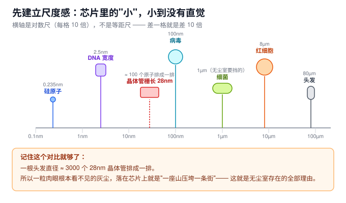
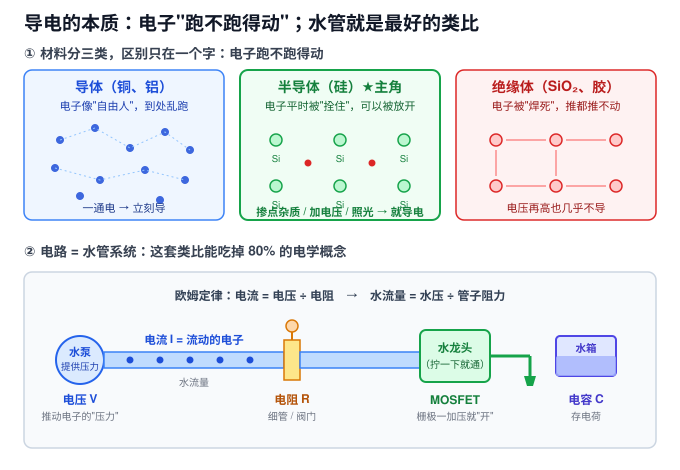
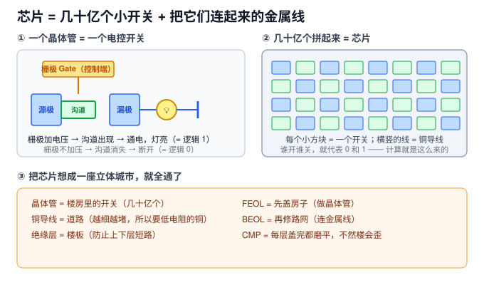

# 00 · 零基础补课：芯片到底是个啥（2.5h）

> **这一章是给"高中物理水平、从没接触过半导体"的人写的。**
> 如果你看到"能带""载流子""Cpk"这类词就头大，**先从这一章开始**，不然第 02、09、10 章你会寸步难行。
> 如果你已经学过电路和模电，扫一眼 0.2 和 0.5 就可以直接跳到第 01 章。

**这一章的目标**：不是让你变专家，而是让你**不再被任何术语吓住**。看完你应该能回答：
芯片是什么、为什么要无尘室、EE 和 PE 在干嘛、以及"28nm"到底是多小。

**关键词**：芯片 / 晶体管 / 开关 / 导电 / 电压电流 / 纳米 / 晶圆 / Fab

---

## 0.1 先说结论：芯片就是"一堆开关"

别被"半导体""集成电路"这些大词唬住。把复杂概念剥掉，芯片就是：

> **在一小块硅片上，做出几十亿个极小的电子开关，再用金属线把它们连起来。**

- 开关**开** = 1，开关**关** = 0
- 几十亿个 0 和 1 组合起来，就能算数、存数据、跑程序

所以整条半导体产业，本质上就干三件事：

| 干什么 | 大白话 | 对应岗位 |
|---|---|---|
| **把开关做出来**（还要越做越小） | 在硅片上"雕"出纳米级的晶体管 | 工艺 PE、光刻、刻蚀 |
| **把开关连起来** | 铺几十层铜导线 | 薄膜、CMP、电镀 |
| **保证做得出来、做得稳** | 机器不能坏、良率要高 | EE、设备、良率 |

你投的 EE 和 PE，就在这个链条里。

---

## 0.2 尺度感：芯片里的"小"，小到完全没有直觉

**这是最关键的一节。** 半导体之所以难理解，90% 是因为它的尺度超出了人类的直觉。

- 1 微米（µm）= 百万分之一米
- 1 纳米（nm）= **十亿分之一米**
- 工艺节点说的 "28nm""7nm"，指的是晶体管的关键尺寸

**记住这三个对比就够了：**

1. **一根头发（约 80µm）的直径，能塞下大约 3000 个 28nm 的晶体管**
2. **一粒肉眼完全看不见的灰尘（1µm 左右），就能压垮一整片电路**
3. 一个 28nm 的沟道长度，**只有一百来个硅原子排成一排那么宽**

**这直接解释了三件你以后一定会遇到的事：**

- **为什么要有无尘室？** 因为灰尘对芯片来说是"陨石"，一颗就毁一个芯片。
- **为什么要真空？** 因为空气分子会乱撞、会带来杂质，在纳米尺度下这是致命的。
- **为什么设备这么贵？** 因为你要在"原子的尺度"上做加工，精度要求是原子级的。

> 面试考过这道题：**"为什么芯片要在无尘室里做？"**
> 标准答法：因为器件尺寸已进入纳米级，一颗亚微米颗粒就会造成图形缺陷或短路，直接导致该芯片失效，因此必须用洁净室控制颗粒。

---

## 0.3 导电的本质：电子"跑不跑得动"

### 三句话讲完电学基础

你只需要三个概念，而且它们都能用水管解释：

| 电学概念 | 水管类比 | 一句话 |
|---|---|---|
| **电压 V** | 水压 | 推动电子的"压力"，单位是伏特 |
| **电流 I** | 水流量 | 电子实际流动的多少，单位是安培 |
| **电阻 R** | 管子的粗细/阀门 | 阻碍电子流动的程度，单位是欧姆 |

**欧姆定律：电流 = 电压 ÷ 电阻**（I = V / R）
用大白话：**水压越大、管子越粗，水就流得越多。**

这就是你需要的全部电学基础。剩下的都是它的变体。

### 材料为什么分三种

原子外面有电子，最外层的电子有的"拴得紧"，有的"拴得松"：

- **导体**（铜、铝）：电子拴不住，到处乱跑 → 一通电就导
- **绝缘体**（玻璃、SiO₂、光刻胶）：电子拴得死死的 → 怎么都不导
- **半导体**（硅）：**平时不太导，但可以被"说服"** → 这就是它值钱的原因

> **半导体为什么这么厉害？**
> 因为它"可以被控制"。你给它掺点杂质、加个电压、照个光，它就能在"导"和"不导"之间切换。
> **能切换 = 能做开关 = 能做芯片。** 导体和绝缘体都做不到这一点。

---

## 0.4 掺杂：往纯硅里"加一点点料"

纯硅（本征硅）导电性很差，没法直接用。做法是往里掺**极微量**的杂质（大概一百万个硅原子里掺几个）：

- 掺**磷 P / 砷 As**（最外层 5 个电子，比硅多 1 个）→ 多出自由电子 → **N 型**（N = Negative，电子带负电）
- 掺**硼 B**（最外层 3 个电子，比硅少 1 个）→ 多出"空位"（空穴）→ **P 型**（P = Positive）

**大白话**：
> - N 型 = 多了一堆可以自由跑的**电子**
> - P 型 = 多了一堆可以"接力传递"的**空位（空穴）**
>
> 把 N 型和 P 型贴在一起，就做出 **PN 结**——它像个"单向阀门"，电流只能从一边往另一边走，反过来就堵死。**这是二极管，也是所有器件的基础。**

**为什么这重要？** 因为 MOSFET（芯片里那个开关）的结构，就是"P 型衬底 + 两个 N 型区 + 上面的栅极"。不懂 N/P 型，后面全看不懂。

---

## 0.5 芯片 = 一座立体城市（这个比喻能吃掉一半的工艺）

把芯片想成一座**立体的超级城市**，所有工艺模块立刻就有意义了：

| 城市的部件 | 芯片里对应什么 | 用什么工艺做 |
|---|---|---|
| 楼房里的开关 | 晶体管 | 光刻 + 刻蚀 + 离子注入（FEOL） |
| 道路 | 铜导线 | 薄膜沉积 + 光刻 + CMP（BEOL） |
| 楼板（防上下层串电） | 绝缘介质层 | CVD 沉积 |
| 每层盖完要磨平 | 全局平坦化 | **CMP** |
| 城市的地皮 | 硅晶圆（Wafer） | 拉单晶 + 切片 |
| 盖楼的工地环境 | 无尘室 + 真空 | 洁净室 + 泵 |

所以你再看那些工艺名词，就不抽象了：

- **光刻** = 用光"画出"这一层的图纸（像用投影仪把电路图印上去）
- **刻蚀** = 按图纸把多余的材料挖掉（像雕刻）
- **薄膜沉积** = 铺一层新材料（像刷墙）
- **离子注入** = 把杂质"打"进硅里改变导电性（像给地基改性质）
- **CMP** = 把表面磨平（像打磨地板，不平的话下一层就没法盖）

---

## 0.6 晶圆和 Fab：工厂长什么样

### 晶圆 Wafer

芯片不是一个个做的，而是在一整片**圆形硅片**上同时做几百上千颗，做完再切开。

- 常见尺寸：**8 寸（200mm）**、**12 寸（300mm）**——指的是圆片直径
- 12 寸比 8 寸**单片产出更多、成本更低**，是主流；8 寸多用于成熟工艺和功率器件
- 一片 12 寸晶圆上可能有几百颗芯片（叫 **Die**），做完测一遍，坏的标掉，好的切开封装

> 面试常问：**"12 寸相对 8 寸的优势？"**
> 答：单片面积是 2.25 倍，可产出的 Die 数量显著增加（约 2.5 倍），单位芯片成本下降；自动化程度更高。缺点是设备与建厂投资更大。

### Fab（晶圆厂）

就是那栋造价几百亿的厂房，里面：

- **无尘室**：空气比手术室干净上千倍，人要穿"兔宝宝装"（bunny suit）
- **机台**：一台光刻机几千万到上亿美元，刻蚀机、薄膜机各几百万美元
- **分工**（你投的岗位就在这）：

| 简称 | 全称 | 一句话职责 | 类比 |
|---|---|---|---|
| **EE** | Equipment Engineer 设备工程师 | 管机器：别坏、坏了快修、定期保养 | 4S 店 + 急诊医生 |
| **PE** | Process Engineer 制程工程师 | 管工艺参数：做出来的东西要合格 | 厨师（调配方） |
| **PIE** | Process Integration Engineer | 管整条流程：各工序要配合好 | 总导演 |
| **YE** | Yield Engineer 良率工程师 | 查为什么有坏的，怎么变好 | 侦探 |

---

## 0.7 三个最常见的困惑（提前帮你拆掉）

**Q1：我不是微电子专业的，会被歧视吗？**
不会。Fab 里大量 EE/PE 是材料、化学、机械、物理、自动化背景。**EE 偏机械+电气，PE 偏化学+材料**，反而非微电子专业更常见。面试真正看的是：能不能吃苦轮班、逻辑是否清楚、是否愿意学。

**Q2：这些东西要背到什么程度？**
分三档：
- **必背**（面试一定会问）：N/P 型、PN 结特性、MOSFET 工作原理、八大工艺模块、光刻八步、CVD/PVD 区别、真空泵类型、无尘室理由、安全常识
- **要会说**：Cpk、OEE、MTBF/MTTR、DOE 的作用（不用会算，知道是什么、为什么用）
- **了解即可**：具体公式推导、器件物理的深层机制

**Q3：公式看不懂怎么办？**
这课的公式（比如瑞利判据、Preston 方程、Cpk）**只要求你记住"它说明什么关系"，不要求推导**。比如 Cpk 你只要知道"越大越好，1.33 是及格线，它衡量的是做出来的东西有多稳定"。

---

## 0.8 章末自测（能默答就过关）

点开看答案

1. **芯片本质上是什么？**
   一堆极小的电子开关 + 连接它们的金属线；开=1、关=0。

2. **28nm 大概是什么概念？**
   约一百来个硅原子排成一排的长度；一根头发直径能塞下约 3000 个。

3. **为什么芯片必须在无尘室里做？**
   器件尺寸是纳米级，一颗亚微米灰尘就会造成缺陷或短路，直接毁掉芯片。

4. **电压、电流、电阻分别类比成什么？**
   水压、水流量、管子阻力（阀门）。

5. **半导体和导体、绝缘体的根本区别是什么？**
   它的导电性可以被控制（掺杂/加电压/照光），而导体和绝缘体不能。

6. **N 型和 P 型分别掺什么？多出来的是什么？**
   N 型掺磷/砷，多自由电子；P 型掺硼，多空穴。

7. **PN 结像什么？**
   单向阀门——正向导通、反向截止。

8. **晶圆为什么越做越大（8 寸→12 寸）？**
   单片产出的芯片数更多，单位成本更低。

9. **EE 和 PE 的核心区别是什么？**
   EE 管设备"能不能跑"，PE 管工艺"做出来的好不好"。

10. **CMP 用城市类比是什么？**
   每层盖完把地面磨平，不磨平下一层就没法盖。

---

## 0.9 下一步

按顺序走：**01 行业与岗位认知 → 02 半导体物理与器件基础 → 03 晶圆制造全流程**。

学习建议：**不要在第一遍就死磕细节。** 先快速通读一遍混个眼熟，第二遍再抠重点。半导体知识是"螺旋式"的——前面不懂的东西，看到后面往往会突然明白。
