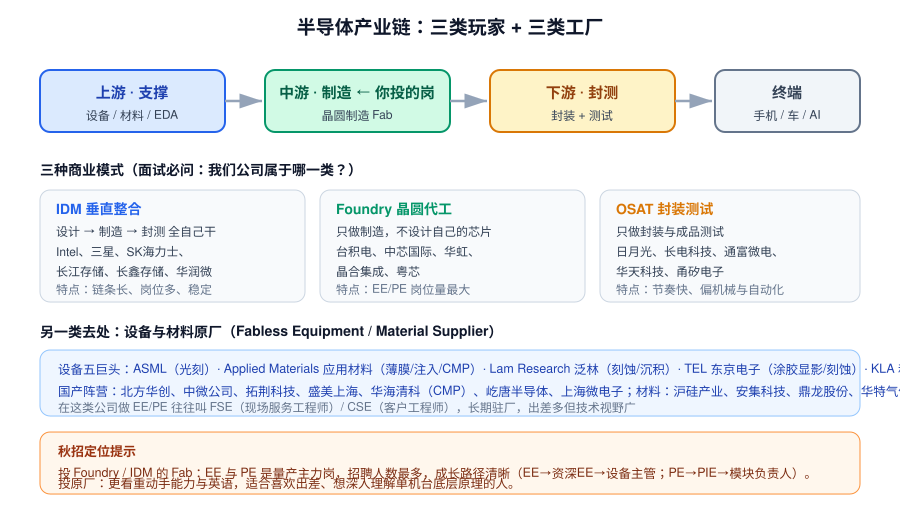
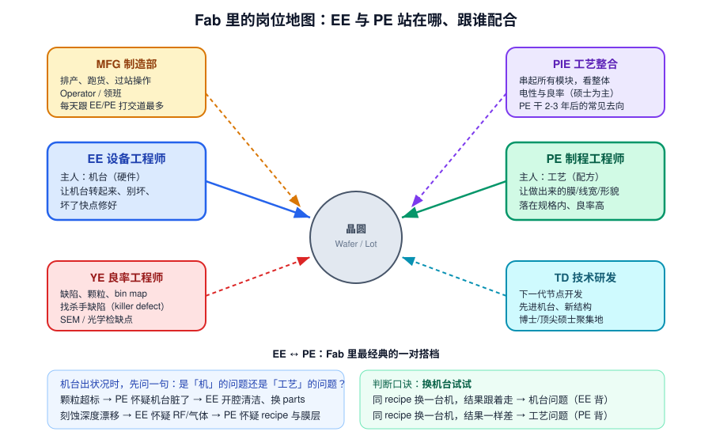

# 1 · 行业与岗位认知（1.5h）

> **学完你能做到**：说清半导体产业链分工；讲明白 EE 和 PE 分别干什么、跟谁配合；知道这行的真实作息与代价；被问"你为什么想来 Fab"时能答得不像背诵。

**关键词**：IDM / Foundry / OSAT / Fab / EE / PE / PIE / MFG / YE / TD / 轮班 / On-call / 无尘室

---
> 🧑‍🏫 **人话速读**（看正文之前，先读这段）
>
> 这章不教技术，教你在面试时**像个圈内人**。只要搞清三件事：芯片从设计到成品经过哪几类公司、Fab 里每个人在干什么、以及这份工作的真实代价（轮班、On-call、穿无尘服）。
> 这些题几乎每场面试都会问，而且答得好不好，直接决定面试官觉得你"有没有认真了解过这行"。

**本章黑话翻译表**（听到这些词别慌）

| 黑话 | 大白话 |
|---|---|
| IDM | 自己设计 + 自己造，一条龙（Intel、三星、士兰微） |
| Foundry | 只代工、不做自己的产品（台积电、中芯国际、华虹） |
| Fabless | 只设计、把制造外包（英伟达、高通、海思） |
| OSAT | 封装 + 测试厂（日月光、长电、通富） |
| Fab | 晶圆厂本身，那栋造价几百亿的楼 |
| EE | Equipment Engineer，管机器的人（修 + 养） |
| PE | Process Engineer，管工艺参数的人（调配方） |
| PIE | 工艺整合，管全流程怎么串起来 |
| On-call | 轮到你就得随时待命，半夜报警也得去 |

---

## 1.1 产业链与三类公司

### 三个环节

| 环节 | 干什么 | 代表公司 |
|---|---|---|
| **上游 支撑** | 设备、材料、EDA 工具 | ASML、AMAT、Lam、TEL、KLA、北方华创、中微、沪硅产业 |
| **中游 制造** | 把设计图变成晶圆上的芯片 ← **EE/PE 主要在这** | 台积电、中芯国际、华虹、长江存储、长鑫、晶合 |
| **下游 封测** | 切割、封装、成品测试 | 日月光、长电、通富微电、华天 |

### 三种商业模式（面试必问：我们属于哪一类？）

| 模式 | 含义 | 代表 | 对 EE/PE 的意义 |
|---|---|---|---|
| **IDM** | 设计→制造→封测全自己干 | Intel、三星、SK海力士、长江存储、长鑫、华润微、士兰微 | 链条长、岗位多、内部转岗机会多 |
| **Foundry** | 只做制造，替别人代工 | 台积电、中芯国际、华虹、晶合、粤芯 | **EE/PE 招聘量最大**，工艺平台多 |
| **OSAT** | 只做封装测试 | 日月光、长电、通富、华天、甬矽 | 节奏快，偏机械/自动化，EE 成分更重 |

### 第四种去处：设备/材料原厂

在 ASML、AMAT、Lam、TEL、北方华创这类公司，对应岗位常叫 **FSE（Field Service Engineer 现场服务工程师）/ CSE（客户工程师）**，长期驻客户 Fab，负责装机、调试、保修、升级。

- 优点：单机台底层原理理解最深、英语与技术视野好、出差补贴
- 缺点：长期驻外/出差、作息被客户产线绑架、归属感弱
- 适合：喜欢动手拆机、能接受长期出差的人

---

## 1.2 Fab 里的岗位地图

| 岗位 | 主人 | 一句话职责 | 谁在干 |
|---|---|---|---|
| **EE** 设备工程师 | 机台（硬件） | 让机台转起来、别坏、坏了快点修 | 本科/硕士，机械电气自动化为主 |
| **PE** 制程工程师 | 工艺（Recipe） | 让做出来的膜/线宽/形貌落在规格内 | 本硕，微电子/材料/物理/化学 |
| **PIE** 工艺整合 | 整条流程 | 串起所有模块，对整体电性与良率负责 | 硕士为主，PE 干 2-3 年后的常见去向 |
| **MFG** 制造部 | 跑货 | 排产、过站操作、产能达成 | 本科，倒班主力 |
| **YE** 良率 | 缺陷 | 找杀手缺陷、做缺陷分类与根因 | 硕士 |
| **TD** 技术研发 | 下一代 | 新节点/新结构开发 | 博士、顶尖硕士 |
| **QA / IE / FA** | 体系/效率/失效 | 质量体系、产能规划、失效分析 | — |

### EE ↔ PE 的经典协作

1. 某批货颗粒超标 → **PE** 怀疑机台脏了 → **EE** 开腔清洁、换耗材
2. 刻蚀深度漂移 → 先做**换机台对照实验**定位归属
3. 新机台导入 → **EE** 装机验收（Buyoff），**PE** 跑工艺验证（Qualification）

> **判断口诀（背下来）**：同一 Recipe 换一台同型号机台跑——
> - 结果**跟着走** → 机台问题，EE 背
> - 结果**一样差** → 工艺问题，PE 背

---

## 1.3 真实的作息与代价（别等入职才发现）

| 现实 | 说明 |
|---|---|
| **轮班** | 量产阶段 24 小时不停机。常见"做二休二"、四班二轮、12 小时制。部分公司新人前 1-2 年不排夜班，但要有心理准备 |
| **On-call 待命** | 休假/半夜被叫回厂处理机台异常是常态。EE 尤其如此 |
| **无尘室** | 进车间要穿洁净服（Bunny Suit），不能带手机、不能跑动、上厕所要换装出来，一趟进出 10 分钟起 |
| **压力来源** | 一片 12 寸晶圆价值数万到数十万元；一次误操作可能造成整批报废。责任清晰、追溯严格 |
| **体力** | EE 需要钻机台、搬 Parts、长时间站无尘室 |
| **回报** | 起薪在制造业中偏上有竞争力，奖金与效益挂钩；技术壁垒高，越老越值钱；国产替代大背景下机会多 |

**面试怎么问/怎么答**：不要装作"我非常能吃苦"，也不要回避。推荐说法——
> "我了解 EE 需要配合轮班和 On-call，我已经和在该行业的学长确认过具体节奏，我认为自己能适应；我更看重的是前两年能在产线上积累真实故障处理经验。"

---

## 1.4 招聘流程长什么样（校招）

1. **简历筛选** — 看专业、专业课成绩、项目/论文、实习
2. **在线测评** — 英语（有六级/托福成绩可能免测）、行测/逻辑、性格测验
3. **技术面（1~2 轮）** — 半导体基础 + 岗位方向 + 情景题
4. **主管/综合面** — 稳定性、轮班意愿、职业规划
5. **HR 面** — 薪资、地点、签约

**简历要点**
- 专业课成绩写上去（半导体物理/器件/材料/固体物理/热力学/统计/控制/电路）
- 项目/论文用 **背景-任务-行动-结果（STAR）** 结构，且必须**量化**
- 英语能力明确标出（设备手册全是英文，这是硬需求）
- 有实验室动手经验（真空、泵、示波器、PLC、CAD）对 EE 是加分项

---

## 1.5 章末自测（能默答再进下一章）

1. IDM、Foundry、OSAT 的区别？各举两家公司。
2. EE 和 PE 的核心区别是什么？出现问题时怎么判断归属？
3. PIE 和 PE 的关系？YE 主要做什么？
4. 在设备原厂做 EE 一般叫什么岗位？和 Fab 里的 EE 有什么不同？
5. 无尘室里有哪些基本纪律？为什么人是最大污染源？
6. 面试被问"能不能接受轮班/On-call"，你怎么回答？

---

## 1.6 延伸（可选，各 15 分钟）

- 查一遍你投递的公司属于产业链哪一环、主力产品是什么、近一年有什么扩产新闻
- 背下三家公司各自的"一句话卖点"，用于回答"为什么选我们"
