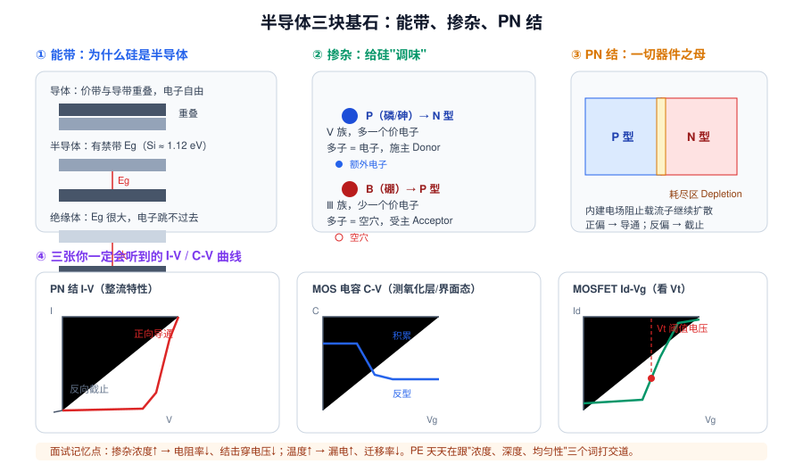
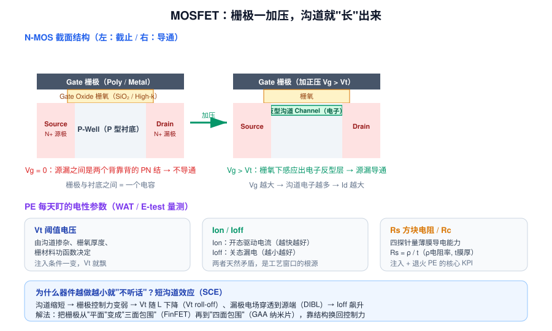
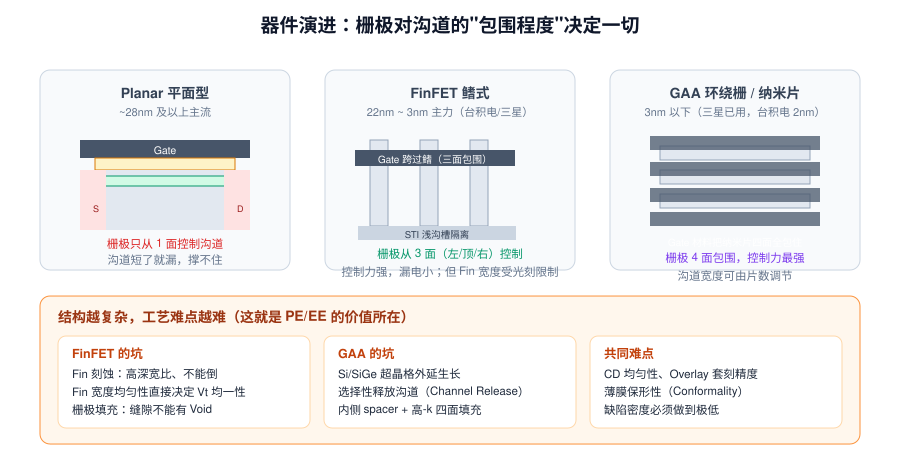

# 2 · 半导体物理与器件基础（3h）

> **学完你能做到**：解释为什么硅能导电也能不导电；说清 N 型/P 型怎么来的；讲明白 MOSFET 是怎么开关的；回答"Vt 由什么决定""为什么器件变小就漏电"这类必考题。

**关键词**：能带 / 禁带 Eg / 本征半导体 / 掺杂 / 施主受主 / 多子少子 / PN 结 / 耗尽区 / MOSFET / Vt / Ion·Ioff / Rs / 短沟道效应 / FinFET / GAA

---
> 🧑‍🏫 **人话速读**（看正文之前，先读这段）
>
> **这是全课最抽象的一章**，但你只要抓住一条主线：芯片 = 开关，开关就是 MOSFET，MOSFET 靠栅极电压控制沟道的"通/断"。
> 能带、掺杂、PN 结这些东西，全都是为了解释"为什么它能被控制"。公式一律**不要推导**，只记结论和变化方向（比如浓度↑电阻↓）。

**本章黑话翻译表**（听到这些词别慌）

| 黑话 | 大白话 |
|---|---|
| 能带 / 禁带 Eg | 电子要"跳多高"才能导电的能量门槛 |
| 掺杂 | 往纯硅里掺极微量的杂质，改变导电能力 |
| N 型 / P 型 | 多出自由电子 / 多出空穴（空位） |
| 多子 / 少子 | 主力载流子 / 少数派载流子 |
| PN 结 | 单向阀门：正向导通、反向截止 |
| 耗尽区 | PN 交界处"没有可动载流子"的隔离带 |
| Vt 阈值电压 | 开关"刚好被打开"的那个栅极电压 |
| 短沟道效应 SCE | 器件太小，栅极管不住沟道 → 关不断 → 漏电 |
| FinFET / GAA | 把栅极从"盖一面"改成"包三面"（鱼鳍）再到"包四面"，管得更牢 |

---

## 2.1 为什么是硅

> 🧑‍🏫 **人话**：为什么偏偏是硅？三个理由：便宜（地壳含量第二）、能拉出超大超纯的单晶、以及**天然氧化物 SiO₂ 性能极好且好做**（这一条是硅当年打败锗的决定性原因）。"能带"听着吓人，你只要理解成"电子要跳多高才能导电"就行。

### 能带：导不导电看"禁带"

- **价带**（低能级，电子被束缚）与**导带**（高能级，电子可自由移动）之间有一段**禁带 Eg**
- 导体：价带导带重叠 → 随便导
- 半导体：Si 的 Eg ≈ **1.12 eV**，室温下热激发就能让少量电子跳上去，所以**可控**
- 绝缘体：Eg 很大 → 基本不导

**为什么 Si 赢了**：地壳含量第二（便宜）、能长出大尺寸高纯单晶、最关键的是**天然氧化物 SiO₂ 性能极好且容易做**（这是硅打败锗的决定性原因）。

### 掺杂：给纯硅"调味"

纯硅（本征硅）载流子太少，没法用。掺入极微量杂质即可把电阻率改变几个数量级：

| 掺杂 | 元素 | 族 | 多子 | 称呼 |
|---|---|---|---|---|
| **N 型** | P（磷）、As（砷）、Sb | Ⅴ 族，多一个价电子 | 电子 | 施主 Donor |
| **P 型** | B（硼）、BF₂ | Ⅲ 族，少一个价电子 | 空穴 | 受主 Acceptor |

**记住三个方向**（面试常考"浓度升高会怎样"）：
- 掺杂浓度 ↑ → 电阻率 ↓
- 掺杂浓度 ↑ → PN 结击穿电压 ↓
- 温度 ↑ → 载流子迁移率 ↓（晶格散射增强）、漏电流 ↑

---

## 2.2 PN 结：一切器件之母

> 🧑‍🏫 **人话**：P 型和 N 型贴在一起后，两边的电子和空穴会**互相跑到对方那边去**，跑完之后交界处只剩下不能动的杂质离子，形成一条"没人区"（耗尽区），它自带电场，会挡住后续继续扩散。正接电压 = 削弱这道墙 → 导通；反接 = 把墙加厚 → 截止。这就是二极管。

P 型与 N 型贴在一起时会发生：

1. 空穴向 N 侧扩散、电子向 P 侧扩散
2. 交界处留下不能动的电离杂质 → 形成**耗尽区 Depletion Region**
3. 耗尽区产生**内建电场**，阻止扩散继续进行 → 达到平衡

**偏置行为**
- **正向偏置**（P 接正、N 接负）：内建电场被削弱 → 载流子大量注入 → **导通**
- **反向偏置**：耗尽区变宽 → 只有极小的反向饱和电流 → **截止**
- 反向电压过大 → 击穿（齐纳击穿 / 雪崩击穿）

**Fab 里的实际用途**：隔离结、二极管、ESD 保护器件、作为寄生效应被规避。

---

## 2.3 MOSFET：开关就是"栅极一加压，沟道就长出来"

> 🧑‍🏫 **人话**：把 MOSFET 想成**水龙头**：栅极是"手"，加上电压就等于拧开阀门，源极和漏极之间出现一条沟道，电流就流过去了。Vt（阈值电压）就是"拧到什么程度才开始出水"。结构上记住四要素：栅极、栅氧化层、源、漏。

### 结构四要素

| 部分 | 材料 | 作用 |
|---|---|---|
| **Gate 栅极** | 多晶硅（早期）/ 金属 + High-k（先进） | 加电压形成电场 |
| **Gate Oxide 栅氧** | SiO₂ → HfO₂ 等高 k 材料 | 绝缘，把电场传下去 |
| **Source / Drain 源漏** | 重掺杂 N+（N-MOS） | 载流子的进出口 |
| **Body / Well 衬底** | P 型（`P-Well`） | 沟道在这里"长"出来 |

### 工作过程

1. **Vg = 0**：源与漏之间是两个背靠背的 PN 结 → 不导通（`Ioff`）
2. **Vg 逐渐增大**：栅极把 P 型衬底里的空穴推开，吸引电子到栅氧下方
3. **Vg ≥ Vt（阈值电压）**：电子浓度超过空穴 → 表面**反型（Inversion）**，形成 N 型导电沟道 → 源漏导通（`Ion`）
4. **Vg 继续增大**：沟道电子更多 → `Id` 更大

一句话记：**栅极和衬底本质是一个电容，加电压改变的是沟道里的载流子浓度。**

### 必背电性参数（PE 天天在量）

| 参数 | 含义 | 受什么影响 |
|---|---|---|
| **Vt** 阈值电压 | 器件"开始导通"的栅压 | 沟道掺杂浓度、栅氧厚度（Tox）、栅材料功函数 |
| **Ion** 开态电流 | 导通时驱动能力，决定速度 | Vt、沟道长度 L、迁移率、串联电阻 |
| **Ioff** 关态漏电 | 关断时漏多少，决定功耗 | 短沟道效应、结漏电、栅漏电 |
| **Rs** 方块电阻 | 薄膜导电能力，Rs = ρ / t | 掺杂浓度、激活率、膜厚 |
| **BV** 击穿电压 | 能承受多大电压 | 掺杂浓度、结深、形貌 |

> **核心矛盾**：Ion 要大（跑得快）、Ioff 要小（省电），二者天然冲突。整个先进工艺史就是在这个矛盾里找平衡。

---

## 2.4 器件变小为什么"不听话"

> 🧑‍🏫 **人话**：器件越做越小，栅极对沟道的"掌控力"就越弱，结果是**该关的时候关不死 → 漏电 → 发热、耗电**。业界的解法很直白：把栅极从"只盖在上面"改成**包住三面**（FinFET，沟道像鱼鳍一样立起来），再进一步**四面全包**（GAA）。目的都是管得更牢。

### 短沟道效应 SCE（Short Channel Effect）

沟道长度 L 缩小到跟耗尽区宽度可比时，栅极对沟道的控制力被削弱：

| 效应 | 现象 |
|---|---|
| **Vt roll-off** | L 越短，Vt 越低，甚至关不断 |
| **DIBL**（漏致势垒降低） | 漏极高电压把势垒拉低，源端电子直接穿过 → Ioff 飙升 |
| **穿通 Punch-through** | 源漏耗尽区连在一起，彻底失控 |
| **GIDL** | 栅漏交叠区高场产生带间隧穿漏电 |
| **热载流子注入 HCI** | 高能载流子打进栅氧，造成可靠性退化 |

### 结构解法：把栅极从"一面"变成"三面"再到"四面"

| 结构 | 栅极包围 | 节点 | 难点 |
|---|---|---|---|
| **Planar** 平面 | 1 面（顶） | ~28nm 以上 | 沟道短了漏电失控 |
| **FinFET** 鳍式 | 3 面（左顶右） | 22nm ~ 3nm | Fin 刻蚀高深宽比、Fin 宽度均匀性、栅极无空洞填充 |
| **GAA** 环绕纳米片 | 4 面 | 3nm 以下 | Si/SiGe 超晶格外延、沟道选择性释放、内侧 spacer |

**为什么 GAA 更强**：沟道宽度可以通过"堆几层纳米片"来调，不再被 Fin 的宽高比锁死。

---

## 2.5 衬底、晶向与晶圆

> 🧑‍🏫 **人话**：晶圆不只是"一片硅"这么简单。晶体的**方向（晶向）**会影响刻蚀速度和器件性能，所以硅片边缘会切一个缺口或平边来标记方向，进机台时按这个方向对位。

- **晶圆尺寸**：4" → 6" → 8"（200mm）→ 12"（300mm）。12 寸单片面积是 8 寸的 2.25 倍，die 数更多、单片成本更低 → 主流
- **晶向**：`(100)` 最常用（界面态少，适合 MOS）；`(111)` 用于部分功率器件
- **Notch / Flat 平边**：晶圆边缘的缺口，用于机械对位与识别晶向
- **SOI**（Silicon on Insulator）：埋氧层上做器件，漏电小、抗辐照，用于特殊与高端场景

---

## 2.6 章末自测

1. 硅的禁带宽度大约是多少？为什么硅比锗更主流？
2. 掺磷和掺硼分别得到什么类型？多子是什么？
3. PN 结正偏和反偏分别是什么状态？耗尽区怎么变化？
4. MOSFET 的沟道是怎么"长"出来的？Vt 是什么？
5. Vt 由哪三个因素决定？
6. 什么是 DIBL？为什么沟道越短越严重？
7. FinFET 相比平面器件，栅极控制力为什么更强？
8. 掺杂浓度升高，电阻率和击穿电压分别怎么变？
9. Ion 和 Ioff 为什么是一对矛盾？
10. 12 寸晶圆相比 8 寸有什么优势？

---

## 2.7 延伸（各 20 分钟，可选）

- 搜索"MOSFET Id-Vd 输出特性曲线"，理解线性区/饱和区
- 搜索"High-k Metal Gate"，理解为什么 SiO₂ 太薄后必须换成 HfO₂
