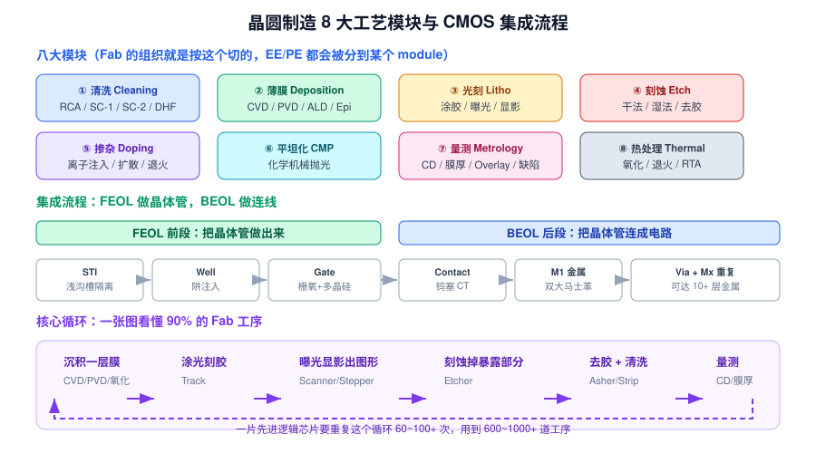

# 3 · 晶圆制造全流程（3h）

> **学完你能做到**：从"沙子"讲到"成品芯片"，中间不卡壳；说清 FEOL/BEOL 分界；画得出那个重复几十次的"核心循环"；被问"一片芯片大概多少道工序"能给出量级答案。

**关键词**：拉单晶 CZ / 抛光片 / 外延 / FEOL / BEOL / STI / Well / Gate / Contact / M1 / Via / 八大模块 / 循环 / Mask 层数

---
> 🧑‍🏫 **人话速读**（看正文之前，先读这段）
>
> 把造芯片想成**盖一栋纳米级的楼**：先备地皮（晶圆），再走几千道工序，其中最核心的动作**重复几十次**——涂胶→曝光→显影→刻蚀→去胶→量测，这一圈叫"核心循环"。
> 前半段 FEOL 把晶体管做出来，后半段 BEOL 铺铜线把它们连起来。这一章给你一张**全局地图**，后面几章都是这张地图的局部放大。

**本章黑话翻译表**（听到这些词别慌）

| 黑话 | 大白话 |
|---|---|
| FEOL | 前段工艺：把晶体管做出来 |
| BEOL | 后段工艺：铺金属线把它们连起来 |
| STI | 挖沟填绝缘，把相邻器件隔开，防止串电 |
| Well 阱 | 在硅里先做一块 P 型或 N 型区域当"地基" |
| Mask 光罩 | 芯片图形的"底片"，一层图形一张 |
| Lot | 一批晶圆，通常 25 片一起走 |
| Cycle Time | 一片晶圆从进厂到出厂要多久 |
| 核心循环 | 涂胶→曝光→显影→刻蚀→去胶→量测，重复几十次 |

---

## 3.1 晶圆是怎么来的（上游，了解即可）

| 步骤 | 做什么 | 关键点 |
|---|---|---|
| 提纯 | 石英砂 → 冶金级硅 → 三氯氢硅 → 电子级多晶硅 | 纯度要到 9N~11N（99.9999999%） |
| **拉单晶 CZ** | 籽晶插入熔硅，缓慢旋转提拉 | 直拉法 Czochralski，控制氧含量与缺陷 |
| 切片/倒角/研磨 | 切成薄片并修边 | — |
| **抛光 CMP** | 得到镜面 | 表面粗糙度要纳米级 |
| **外延 Epi** | 在表面再长一层单晶硅 | 提高纯度、做 Si/SiGe 结构 |
| 清洗/检验出货 | 交给 Fab | 沪硅产业、立昂微、TCL 中环、SUMCO、信越 |

---

## 3.2 八大工艺模块（Fab 的组织就是按这个切的）



| # | 模块 | 干什么 | 代表设备商 |
|---|---|---|---|
| ① | **清洗 Cleaning** | 去除颗粒、有机物、金属、 native oxide | 盛美、TEL、Screen |
| ② | **薄膜 Deposition** | 长出介质/金属/半导体薄膜 | AMAT、Lam、TEL、拓荆、北方华创 |
| ③ | **光刻 Litho** | 把图形"印"到光刻胶上 | ASML、Nikon、Canon、上海微电子 |
| ④ | **刻蚀 Etch** | 把光刻胶图形转移到下层膜 | Lam、TEL、AMAT、中微、北方华创 |
| ⑤ | **掺杂 Doping** | 注入杂质改变导电性 | AMAT、Axcelis、万业企业 |
| ⑥ | **平坦化 CMP** | 把表面磨平 | AMAT、华海清科、Ebara |
| ⑦ | **量测 Metrology** | 量厚度/线宽/套刻/缺陷 | KLA、AMAT、上海精测 |
| ⑧ | **热处理 Thermal** | 氧化、退火、激活 | AMAT、TEL、屹唐 |

---

## 3.3 核心循环：看懂这张图就懂了 90% 的 Fab

```
① 沉积/生长一层膜  →  ② 涂光刻胶  →  ③ 曝光+显影（得到胶上的图形）
        ↑                                          ↓
   ⑥ 量测 & 清洗  ←  ⑤ 去胶 Ashing  ←  ④ 刻蚀/注入（把图形转到膜上）
```

一次循环产出一层"有图形的膜"。先进逻辑芯片要重复这个循环 **60~100+ 次**，用到 **600~1000+ 道工序**，光罩（Mask/Reticle）层数可达 60~80 层。

---

## 3.4 FEOL：把晶体管做出来

| 顺序 | 步骤 | 用什么模块 | 要点 |
|---|---|---|---|
| 1 | **STI 浅沟槽隔离** | 刻蚀 + CVD + CMP | 把每个器件隔开，防止互相干扰 |
| 2 | **Well 阱形成** | 光刻 + 离子注入 | 做 P-Well / N-Well（CMOS 需要两种） |
| 3 | **沟道掺杂 / Vt 调整** | 注入 | 决定 Vt |
| 4 | **栅氧 Gate Oxide** | 热氧化 / ALD | 最薄也最关键的一层膜 |
| 5 | **栅极 Gate** | CVD 多晶硅 / 金属 + 刻蚀 | 决定 L（沟道长度），是"几纳米"的来源 |
| 6 | **LDD 轻掺杂漏** | 注入 | 缓解热载流子效应 |
| 7 | **Spacer 侧墙** | CVD + 各向异性刻蚀 | 隔离栅极与源漏 |
| 8 | **源漏重掺杂 S/D** | 注入 / 选择性外延 | 降低接触电阻 |
| 9 | **退火 Anneal** | RTA / 激光 | 修复损伤并激活杂质 |
| 10 | **Salicide 自对准硅化物** | 金属沉积 + 退火 | 进一步降低 Rs |

---

## 3.5 BEOL：把晶体管连成电路

| 步骤 | 说明 |
|---|---|
| **Contact（CT / MD）** | 从器件引出的第一级接触孔，通常用钨（W）填充 |
| **M1 第一层金属** | 现代工艺用**双大马士革 + 铜**（详见第 05 章） |
| **Via + Mx 重复** | 通孔 + 上层金属，逐层往上堆 |
| **Top Metal + Passivation** | 顶层厚金属（供电/键合）+ 钝化保护层 |
| **Al Pad** | 引出焊盘，供封装打线 |

先进逻辑芯片的金属层可达 **10~15 层以上**；存储芯片（DRAM/3D NAND）结构不同但同样层数极多。

**为什么 BEOL 用铜？** 电阻率更低、抗电迁移更好。但铜会扩散进硅造成深能级污染，必须先用 TaN/Ta 阻挡层包住，且铜很难用干法刻蚀 → 才有了"先挖沟槽再填铜再磨平"的大马士革工艺。

---

## 3.6 后段：出厂前的最后几步

| 步骤 | 说明 |
|---|---|
| **WAT / E-test** | 测划片道上的测试结构，看 Vt、Rs、击穿等是否合格 |
| **CP 中测** | 探针台逐颗 Die 测试，标记坏的（Ink / Map） |
| **背面减薄 + 划片** | 磨薄晶圆并切成一颗颗 Die（部分先划后测） |
| **封装** | 把 Die 装到基板上，打线/倒装，塑封 |
| **FT 终测** | 成品功能与可靠性测试 |
| **Burn-in / 可靠性** | 老化、温循、HTOL 等 |

> EE/PE 主要在**前段晶圆制造**。封装厂（OSAT）的 EE/PE 更偏机械、自动化与测试。

---

## 3.7 几个常用生产概念

| 概念 | 含义 |
|---|---|
| **Lot** | 一批晶圆，通常 25 片一盒（FOUP） |
| **Wafer / Slot** | 一片晶圆 / 它在盒子里的位置编号 |
| **Recipe** | 机台跑某道工序的"程序"（参数集合），PE 的核心资产 |
| **Flow / Route** | 一整套工艺流程，由 MES 系统控制流转 |
| **Cycle Time** | 一片晶圆从投料到出厂的总时间，先进逻辑约 2~3 个月 |
| **Throughput** | 机台每小时能处理多少片（WPH），决定产能 |
| **WIP** | 在制品，产线上正在跑的晶圆 |
| **Bottleneck** | 瓶颈机台，通常是光刻/EUV 或某些刻蚀 |
| **Mask / Reticle** | 光罩，一层图形一张，是极贵的资产 |

---

## 3.8 章末自测

1. 从硅料到抛光片，主要经过哪几步？
2. 八大工艺模块是哪八个？各举一个代表设备商。
3. 那个"核心循环"是哪六步？一片先进芯片大概循环多少次？
4. FEOL 和 BEOL 的分界在哪里？各自做什么？
5. STI、Well、Spacer、LDD 分别在解决什么问题？
6. 为什么 BEOL 用铜而不是铝？为什么必须用大马士革工艺？
7. Cycle Time 和 Throughput 分别是什么意思？
8. 一盒晶圆通常多少片？叫什么？
9. 什么叫 Bottleneck 机台？为什么光刻常是瓶颈？
10. WAT 和 CP 分别在哪个阶段、测什么？

---

## 3.9 延伸（可选，20 分钟）

- 找一张真实的 CMOS 剖面 SEM 图，对照 FEOL 步骤逐个指认
- 查一下"3D NAND 的工艺特点"，理解存储与逻辑工艺的差异
