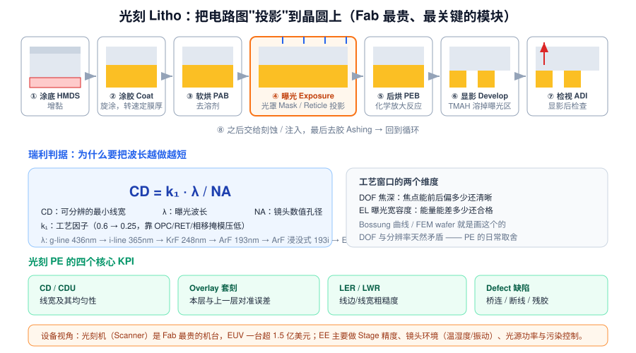
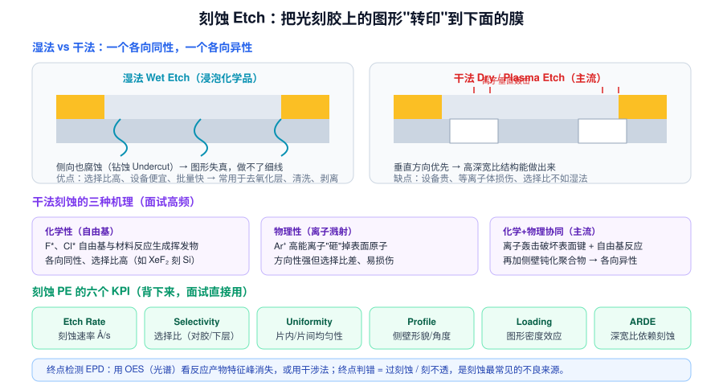
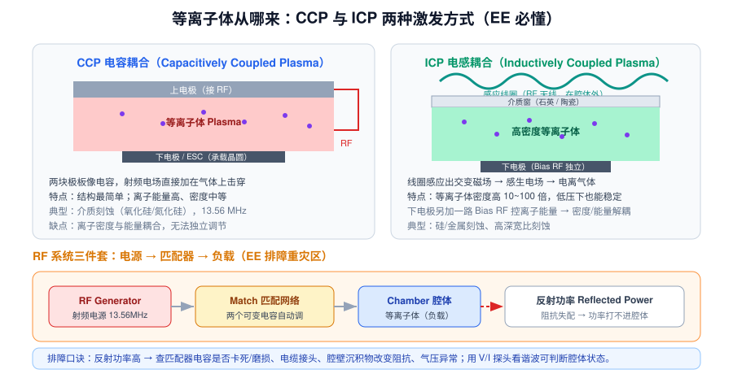

# 4 · 光刻与刻蚀（3h）

> **学完你能做到**：完整讲出光刻八步；解释瑞利判据和为什么需要 EUV；说清干法刻蚀为什么能做高深宽比；背下光刻和刻蚀各自的核心 KPI；被问"线宽偏了怎么办""刻蚀刻不透怎么排查"时给出结构化答案。

**关键词**：HMDS / Coat / PAB / Exposure / PEB / Develop / ADI / CD / CDU / Overlay / LER / DOF / EL / OPC / EUV / 各向异性 / 选择比 / CCP / ICP / RF Match / EPD 终点检测 / ARDE / Loading

---
> 🧑‍🏫 **人话速读**（看正文之前，先读这段）
>
> 两句话概括这章：**光刻 = 用光把电路图投影到硅片上（像洗照片）；刻蚀 = 按投影出来的图形把材料挖掉（像雕刻）。**
> 这俩是 Fab 里最贵、最核心、最卡脖子的工序。核心记住两点：波长越短分辨得越细（所以要 EUV）；刻蚀要"只往下挖、不往旁边钻"（各向异性）。

**本章黑话翻译表**（听到这些词别慌）

| 黑话 | 大白话 |
|---|---|
| CD 线宽 | 做出来的线到底有多粗 |
| CDU | 线宽的均匀性，一片内 / 片与片之间差多少 |
| Overlay 套刻 | 这一层和上一层的图形对准了没有 |
| DOF 焦深 | 高度方向允许多大误差还能印清楚 |
| EUV | 极紫外光刻，波长 13.5nm，一台上亿美元 |
| OPC | 在光罩上预先"画歪"，补偿曝光时的变形 |
| 各向异性 | 只往下挖，不横向钻 —— 这是干法刻蚀的核心优势 |
| 选择比 | 只刻目标材料、不刻别的（以及不刻下面那层）的能力 |
| CCP / ICP | 两种产生等离子体的方式，ICP 更灵活 |
| EPD 终点检测 | 判断"刻到没刻到位"并自动停下来的检测 |

---

## 4.1 光刻：Fab 里最贵、最核心的模块

> 🧑‍🏫 **人话**：把光刻想成**洗照片**：先在硅片上涂一层感光胶（光刻胶），再用光把电路图"投影"上去，被照到的地方化学性质变了，用药水一洗（显影），图形就出来了。八步听着多，主干只有三个字：**涂 → 曝 → 显**。



### 八步流程（按顺序背）

| 步骤 | 英文 | 干什么 | 关键控制点 |
|---|---|---|---|
| ① | **HMDS 增黏** | 让光刻胶更好附着 | 表面处理 |
| ② | **Coat 涂胶** | 旋涂光刻胶 | **转速决定膜厚**；胶厚均匀性 |
| ③ | **PAB 软烘** | 烘掉溶剂 | 温度/时间 |
| ④ | **Exposure 曝光** | 通过光罩把图形投影到胶上 | 能量 Dose、Focus 焦距 |
| ⑤ | **PEB 后烘** | 化学放大反应（CAR 胶） | 温度极度敏感 |
| ⑥ | **Develop 显影** | 用 TMAH 溶掉可溶部分 | 显影时间、浓度 |
| ⑦ | **ADI 显影后检查** | 在线检视 | 有没有缺陷、CD 是否合格 |
| ⑧ | **→ 刻蚀/注入 → 去胶 Ashing** | 交给下游 | — |

**Track（涂胶显影机）+ Scanner（曝光机）通常是一体的产线**，TEL 是 Track 的绝对主力。

### 正胶 vs 负胶

- **正胶 Positive**：曝光区变可溶 → 显影后留下的 = 未曝光区（图形与掩模"亮区"相反）
- **负胶 Negative**：曝光区变不溶 → 留下的 = 曝光区
- 先进逻辑几乎全用**化学放大型正胶 CAR**（灵敏度高）

---

## 4.2 瑞利判据：为什么波长越做越短

> 🧑‍🏫 **人话**：瑞利判据就一句话：**想分辨更细的线，就用更短的波长、更大的镜头口径，或者用更聪明的工艺 trick。** 所以曝光波长一路从 436nm 杀到 193nm，再到 13.5nm 的 EUV（这也是 EUV 为什么那么贵、那么卡脖子）。

```
CD = k₁ · λ / NA
```

| 符号 | 含义 | 怎么压低 CD |
|---|---|---|
| **CD** | 可分辨的最小线宽 | 目标就是要小 |
| **λ** | 曝光波长 | 越短越好 |
| **NA** | 数值孔径 | 越大越好（做大镜头、浸没式 n>1） |
| **k₁** | 工艺因子 | 靠 OPC / 相移掩模 / 多重图形化压低 |

**波长演进**：g-line 436nm → i-line 365nm → KrF 248nm → ArF 193nm → **ArF 浸没式 193i**（用水做介质提高 NA）→ **EUV 13.5nm**

- 193i + **多重图形化**（SADP / LELE / SAQP）能撑到 7nm
- 7nm 以下引入 **EUV**：光源是锡等离子体，全反射镜（不能用透镜）、**必须在真空中**、功率与掩模缺陷是难点
- EUV 一台超过 1.5 亿美元，是 Fab 最贵资产

### 工艺窗口的两个维度

- **DOF（Depth of Focus）焦深**：焦点前后能偏多少还清晰
- **EL（Exposure Latitude）曝光宽容度**：能量差多少还合格

> **DOF 与分辨率天然矛盾** —— 这是光刻 PE 每天都在做的取舍。画 **Bossung 曲线**和跑 **FEM wafer**（能量-焦距矩阵）就是找这个窗口。

### 分辨率增强技术 RET

| 技术 | 思路 |
|---|---|
| **OPC 光学邻近修正** | 在掩模上预先"画歪"（加锤头、衬线），抵消衍射失真 |
| **PSM 相移掩模** | 利用相位相消提高对比度 |
| **OAI 离轴照明** | 改变照明角度提高分辨率与 DOF |
| **SADP/SAQP 自对准多重图形** | 用侧墙把间距"分频"，突破单次曝光极限 |

---

## 4.3 光刻的四个核心 KPI

> 🧑‍🏫 **人话**：光刻做得好不好，用四个指标衡量：线宽做对没有（CD）、一片内和片与片之间差多少（CDU）、和上一层对准了没有（Overlay）、以及良率窗口有多大（工艺宽容度）。前三个天天在量。

| KPI | 含义 | 差了会怎样 |
|---|---|---|
| **CD / CDU** | 线宽及其片内/片间均匀性 | 器件速度不一致、Vt 分布变宽 |
| **Overlay 套刻** | 本层与上一层的对准误差 | 接触孔打偏 → 开路/短路 |
| **LER / LWR** | 线边/线宽粗糙度 | 漏电增加、可靠性下降 |
| **Defect** | 桥连、断线、残胶、颗粒 | 直接掉良率 |

**EE 视角**：光刻机（Scanner）维护重点是 **Stage 精度与速度**、**镜头环境**（温度控制到 ±0.01℃、减振、防 AMC 污染）、**光源功率稳定性**、**掩模台与 Reticle 污染**。

---

## 4.4 刻蚀：把胶上的图形转到下面的膜

> 🧑‍🏫 **人话**：刻蚀 = 按胶上的图形**雕刻**。湿法刻蚀是"泡药水"，各方向一起溶，会横向钻，做不了细线；干法刻蚀是用等离子体里的离子**垂直轰击**，只往下挖不横着挖（各向异性），所以能做几十纳米的细线条。



### 湿法 vs 干法

| | 湿法 Wet | 干法 Dry / Plasma |
|---|---|---|
| 介质 | 化学药液（HF、磷酸、TMAH） | 等离子体（真空腔） |
| 方向性 | **各向同性**，会钻蚀 Undercut | **各向异性**，垂直向下 |
| 选择比 | 高 | 中等 |
| 设备成本 | 低 | 高 |
| 用途 | 去氧化层、清洗、剥离、某些体硅加工 | **主流**，几乎所有图形转移 |

### 干法刻蚀的三种机理

1. **纯化学**：F\*、Cl\* 自由基与材料反应生成挥发性产物 → 各向同性、选择比高
2. **纯物理**：Ar⁺ 高能离子溅射 → 方向性好但选择比差、损伤大
3. **化学+物理协同（主流）**：离子轰击破坏表面键 → 自由基反应更容易 → 同时通入钝化气体在**侧壁形成聚合物保护层**，阻止侧向刻蚀 → 实现各向异性

> **经典案例**：Bosch 工艺（深硅刻蚀）——交替通入 SF₆（刻蚀）与 C₄F₈（钝化），做出高深宽比的垂直深槽，侧壁有扇贝形纹路。

### 刻蚀的六个 KPI（背下来）

| KPI | 含义 |
|---|---|
| **Etch Rate** 速率 | Å/s 或 nm/min，决定产能 |
| **Selectivity** 选择比 | 目标膜刻蚀速率 / 光刻胶或下层膜速率，越高越不容易刻穿 |
| **Uniformity** 均匀性 | 片内、片间、批次间的厚度一致性 |
| **Profile** 形貌 | 侧壁角度（90° 理想）、是否 Bowing/Undercut/Notching |
| **Loading** 负载效应 | 图形密度不同导致局部速率不同（密集区慢、稀疏区快） |
| **ARDE** 深宽比依赖 | 孔越深越细，越难刻（传质受限） |

### 终点检测 EPD

- **OES 发射光谱**：监测反应产物的特征峰，消失即为终点
- **干涉法**：膜厚变化引起反射光干涉周期性变化
- 终点判错 = **过刻蚀**（伤下层）或**没刻透**（短路）→ 最常见的刻蚀不良来源

---

## 4.5 等离子体怎么来的

> 🧑‍🏫 **人话**：等离子体就是**把气体电离成一锅带电的汤**，里面的离子在电场作用下有方向性地撞向硅片。CCP（电容耦合）里等离子体密度和轰击能量是绑在一起的；ICP（电感耦合）能把两者分开调，所以更灵活、更常用。RF 匹配器的作用是把射频功率全部送进腔体——匹配不好功率会被反射回来，轻则工艺不稳，重则烧设备。



| | CCP 电容耦合 | ICP 电感耦合 |
|---|---|---|
| 激发 | 两块极板像电容，RF 电场直接击穿气体 | 腔外线圈感应出交变磁场 → 感生电场电离 |
| 等离子体密度 | 中等 | 高 10~100 倍 |
| 离子能量 | 高 | 由下电极 Bias RF **独立控制** |
| 耦合 | 密度与能量耦合，无法独立调 | **密度/能量解耦**，工艺窗口更大 |
| 典型 | 介质刻蚀（氧化硅/氮化硅） | 硅/金属刻蚀、高深宽比刻蚀 |

### RF 系统三件套（EE 排障重灾区）

`RF Generator（13.56MHz）` → `Match 匹配网络（两个可变电容）` → `Chamber 腔体（等离子体负载）`

- **反射功率 Reflected Power 高** = 阻抗失配，功率打不进腔体 → 等离子体不稳或根本点不着
- 排查顺序：匹配器电容是否卡死/磨损 → 电缆接头是否松动/烧蚀 → 腔壁沉积物改变阻抗 → 气压/气体配比异常 → 用 V/I 探头看谐波

---

## 4.6 面试高频：情景题怎么答

**Q：某天刻蚀深度偏低，你怎么排查？**

> 结构化答法（展示方法论，不要瞎猜）：
> 1. **先遏制**：确认影响范围（哪几片、哪几个 Lot），Hold 相关货，必要时停机台
> 2. **看数据**：调出 FDC/SPC 趋势——是突变还是渐变？突变→零件损坏/断电/报警；渐变→耗材老化、腔壁沉积
> 3. **拆分变量**：先看刻蚀速率还是刻蚀时间？速率掉 → 查压力/功率/气体流量/温度
> 4. **对照实验**：换一台同型号机台跑同一 Recipe → 定位 EE 还是 PE
> 5. **逐项验证**：检查 MFC 流量校准、RF 反射功率、真空度与 Leak Rate、ESC 温度与 He 背冷、腔体洁净度与 PM 时间
> 6. **闭环**：确认根因后写 8D，横向展开到同型号机台，必要时调整 PM 周期

**Q：CD（线宽）偏大，可能原因有哪些？**

> 光刻侧：曝光能量 Dose 偏高（正胶→线宽变细/粗因胶型而定）、Focus 偏离最佳、显影时间过长、PEB 温度漂移、光刻胶批次差异、掩模 CD 偏差
> 刻蚀侧：过刻蚀/欠刻蚀、侧壁聚合物过厚、 Bias Power 变化
> 量测侧：CD-SEM 电子束造成胶收缩/污染，量测条件漂移
> **排查顺序**：先确认量测没问题 → 再看 SPC 趋势 → 再做换机台对照

---

## 4.7 章末自测

1. 光刻八步按顺序说出来。Track 和 Scanner 分别负责哪些步？
2. 瑞利判据是什么？降低 CD 有哪几条路？
3. 为什么要用 EUV？EUV 为什么必须在真空中？
4. DOF 和 EL 是什么？为什么它们和分辨率矛盾？
5. OPC 是在解决什么问题？
6. 干法刻蚀凭什么能各向异性？（答"侧壁钝化"）
7. 选择比定义是什么？为什么重要？
8. Loading 效应和 ARDE 分别是什么？
9. CCP 和 ICP 的区别？为什么 ICP 的工艺窗口更大？
10. RF 反射功率高说明什么？你的排查顺序是什么？
11. 刻蚀终点检测有哪两种常用方法？终点判错会怎样？
12. 刻蚀深度偏低，按什么顺序排查？

---

## 4.8 延伸（可选，各 20 分钟）

- 查"多重图形化 SADP"原理图，理解为什么要用 spacer 分频
- 查"Bosch 工艺"动画，理解深硅刻蚀的循环
