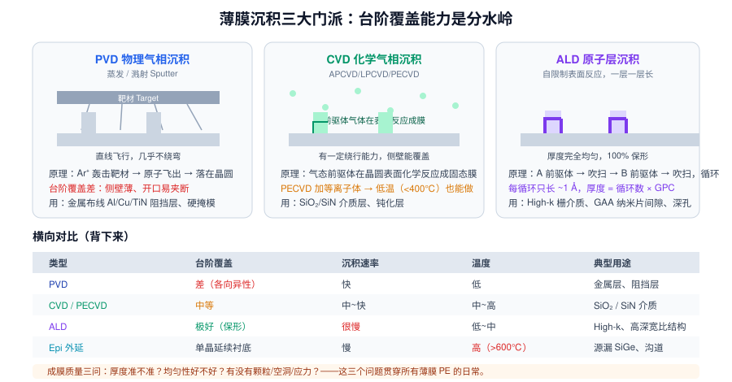
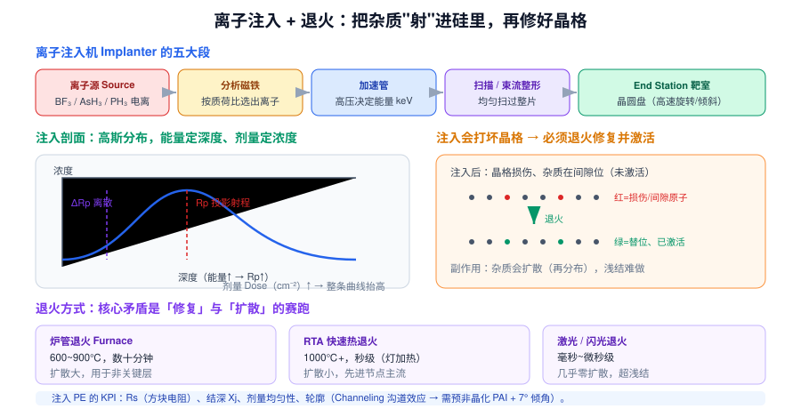

# 04 · 薄膜 · 掺杂 · 热处理（3h）

> **学完你能做到**：说出 CVD/PVD/ALD 的取舍逻辑；解释台阶覆盖率为什么是关键；讲清离子注入 + 退火的完整逻辑；回答"Rs 偏高怎么查""薄膜厚度不均匀怎么查"。

**关键词**：CVD / PECVD / LPCVD / APCVD / ALD / PVD / 溅射 / Epi 外延 / 台阶覆盖 / 保形性 / GPC / 离子注入 / Dose / Energy / Rp / 沟道效应 / 退火 / RTA / Rs / Xj / 激活率 / 氧化 / RCA 清洗

---

## 4.1 薄膜沉积三大门派



### 一张表看懂

| 类型 | 原理 | 台阶覆盖 | 速率 | 温度 | 典型用途 |
|---|---|---|---|---|---|
| **PVD** | Ar⁺ 轰击靶材，原子直线飞到晶圆 | **差**（各向异性） | 快 | 低 | Al/Cu/TiN 阻挡层、籽晶层、硬掩模 |
| **CVD** | 气态前驱体在表面化学反应成固态膜 | 中等 | 中~快 | 中~高 | SiO₂、SiN、多晶硅 |
| **PECVD** | CVD + 等离子体（降低反应温度） | 中等 | 快 | **低（<400℃）** | 介质层、钝化层 |
| **ALD** | 两种前驱体交替、自限制表面反应 | **极好（保形）** | 很慢 | 低~中 | High-k、GAA 纳米片间隙、深孔 |
| **Epi 外延** | 在单晶表面延续晶格继续长 | 单晶延续 | 慢 | **高（>600℃）** | 源漏 SiGe、沟道、Si 外延层 |

**台阶覆盖率（Step Coverage）为什么是分水岭？**
先进结构（深孔、高深宽比沟槽、GAA 纳米片间隙）里，PVD 会在开口处"夹断"形成空洞（Void / Keyhole），而 ALD 能均匀铺满每一个角落。所以越先进的节点越依赖 ALD。

### CVD 的几个亚种

| 类型 | 全称 | 压力 | 特点 |
|---|---|---|---|
| **APCVD** | 常压 CVD | 常压 | 简单、快，但均匀性和颗粒差 |
| **LPCVD** | 低压 CVD | 低压 | 均匀性好、保形好，温度高 |
| **PECVD** | 等离子增强 CVD | 低压 | **温度低**，可做在金属层之上 |

### ALD 的循环（背下来）

```
① 通入前驱体 A → 表面饱和吸附
② 惰性气体吹扫 Purge → 带走多余 A 与副产物
③ 通入前驱体 B → 与 A 反应生成一个单层
④ 吹扫 Purge
→ 一个循环长 ~1 Å（GPC, Growth Per Cycle）
→ 膜厚 = 循环数 × GPC
```

**关键**：自限制（Self-limiting）——表面饱和后就不再长，所以厚度极均匀、保形性接近 100%，代价是慢。

---

## 4.2 薄膜的三问（PE 的日常工作）

1. **厚度准不准？** → 椭偏仪/XRF 量测，调沉积时间或循环数
2. **均匀性好不好？** → 片内/片间/批次间；调气流分布、温度分区、压力、靶材寿命
3. **有没有缺陷？** → 颗粒、空洞（Void）、缝隙（Seam）、应力（Stress）、 crack

| 常见薄膜不良 | 典型原因 |
|---|---|
| 颗粒 Particle | 腔壁沉积物脱落、靶材异常、气体纯度、前道残留 |
| 空洞 Void / 缝隙 Seam | 台阶覆盖差，开口提前夹断 |
| 应力过大导致翘曲 | 温度、沉积速率、膜层结构不匹配 |
| 膜厚漂移 | 靶材消耗、腔壁条件变化（Chamber Seasoning）、MFC 漂移 |
| 折射率 n 变化 | 成分/密度变化，致密化程度不同 |

> **Chamber Seasoning（腔体"调味"）**：刚做完 PM 清洁的腔体，内壁条件与"跑了很久"的腔体不同，前几片结果会飘，需要用 Dummy Wafer 跑几片让腔壁"稳定"下来。这是 EE 和 PE 交接时的经典坑。

---

## 4.3 掺杂：离子注入



### 注入机五大段

`离子源 Source` → `分析磁铁（选离子种类）` → `加速管（定能量）` → `扫描/束流整形` → `End Station 靶室（晶圆盘高速旋转+倾斜）`

### 两个核心参数

| 参数 | 决定什么 | 单位 |
|---|---|---|
| **Dose 剂量** | 掺进去多少（浓度） | ions/cm² |
| **Energy 能量** | 掺多深（射程 Rp） | keV |

**注入剖面是近似高斯分布**：
- 峰值位置 = **Rp 投影射程**（能量 ↑ → Rp ↑，越深）
- 展宽 = **ΔRp**（能量越高越散）
- 曲线下面积 = **Dose**

### 沟道效应 Channeling（必考）

硅晶体有规则的原子排列通道，如果离子**正好沿晶向**射入，会像打保龄球一样一路滑进去，射程远超预期 → 结深失控。

**两种解法**：
1. 晶圆**倾斜 7°**（现在主流做法，代价是阴影效应）
2. **预非晶化 PAI**：先注入 Si/Ge 把表层打成非晶，破坏通道

### 注入的副作用

- **晶格损伤**：离子把原子撞离原位 → 形成缺陷、甚至非晶化
- **杂质未激活**：大部分杂质停在**间隙位**，不提供载流子

---

## 4.4 退火：修好晶格并激活杂质

| 方式 | 温度/时间 | 扩散程度 | 用途 |
|---|---|---|---|
| **炉管 Furnace** | 600~900℃，数十分钟 | 大 | 非关键层、氧化 |
| **RTA 快速热退火** | 1000℃+，秒级（卤素灯加热） | 小 | **先进节点主流** |
| **激光/闪光退火** | 毫秒~微秒级 | 几乎为零 | 超浅结 |

**核心矛盾**：温度越高时间越长 → 修复越彻底、激活率越高；但**杂质扩散也越多 → 结深 Xj 变大**，浅结就做不出来。先进节点必须"高温短时"。

### 注入 PE 的 KPI（背）

- **Rs 方块电阻**：Rs = ρ / t，四探针量测。Rs 偏高 → 剂量不足？激活率不够？结深太浅？
- **Xj 结深**：SIMS 或扩展电阻剖面（SRP）
- **剂量均匀性**：片内/片间
- **Profile 轮廓**：是否出现沟道拖尾

---

## 4.5 热氧化与扩散（了解）

- **干氧氧化**（Si + O₂ → SiO₂）：膜质最好，慢
- **湿氧氧化**（Si + H₂O → SiO₂）：快，膜质略差
- **Deal-Grove 模型**：氧化速率受"氧化剂扩散过已生成氧化层"控制 → 越厚越慢，呈抛物线
- **扩散**：高温下杂质沿浓度梯度迁移。现代工艺基本被离子注入取代，只在少数场景（如驱入 Drive-in）使用

---

## 4.6 清洗（贯穿全程）

| 方法 | 配方 | 去什么 |
|---|---|---|
| **SC-1 / APM** | NH₄OH / H₂O₂ / H₂O | 颗粒、有机物 |
| **SC-2 / HPM** | HCl / H₂O₂ / H₂O | 金属离子 |
| **DHF 稀 HF** | HF / H₂O | 去除自然氧化层（Native Oxide） |
| **SPM / 食人鱼** | H₂SO₄ / H₂O₂ | 光刻胶、重有机物 |
| **DIW 冲洗 + 干燥** | 超纯水 | Marangoni 干燥 / IPA 干燥，防水印 |

**清洗是 Fab 里次数最多的工序**——几乎每道主要工序前后都要洗。

---

## 4.7 面试高频情景题

**Q：Rs（方块电阻）偏高，你怎么排查？**

> 1. 确认量测：四探针是否校准、探针压力、量测位置图（Site Map）是否一致
> 2. 看趋势：突变还是渐变？哪个机台？哪个 Recipe？
> 3. 拆变量：Rs 由**剂量、激活率、结深、膜厚**共同决定
>    - 剂量不足 → 查注入机束流、剂量计、扫描均匀性
>    - 激活率不够 → 查退火温度/时间、RTA 灯管功率衰减、温度校准
>    - 结深变化 → 查注入能量、预非晶化
>    - 膜厚变化 → 查前道沉积
> 4. 对照实验：换机台、换退火炉管
> 5. 交叉验证：SIMS 看掺杂轮廓，TEM 看损伤与非晶层厚度

**Q：CVD 薄膜厚度片内不均匀，可能原因？**

> 气流分布（Shower Head 堵塞/变形）、温度分区异常（Heater 分区故障、He 背冷不均）、压力与间距（Spacing）、前驱体饱和蒸气压不稳（源瓶温度）、腔壁沉积改变流场、载气流量波动（MFC 漂移）、基座（Susceptor）变形或结垢

---

## 4.8 章末自测

1. PVD、CVD、ALD 在台阶覆盖上的排序？为什么？
2. ALD 一个循环包含哪四步？为什么能"保形"？
3. PECVD 相比普通 CVD 最大的优势是什么？
4. 外延 Epi 和普通沉积的本质区别是什么？
5. 离子注入的 Dose 和 Energy 分别决定什么？
6. 什么是沟道效应？怎么抑制？
7. 为什么注入后必须退火？退火带来的副作用是什么？
8. RTA 相比炉管退火的优势是什么？
9. Rs 偏高可能有哪些原因？
10. SC-1、SC-2、DHF 分别去什么？
11. Deal-Grove 模型的物理图像是什么？
12. 什么叫 Chamber Seasoning？PM 后为什么要用 Dummy Wafer？

---

## 4.9 延伸（可选，20 分钟）

- 查"高深宽比填充"的几种工艺（HDP-CVD、FCVD、ALD），理解为什么深孔填充这么难
