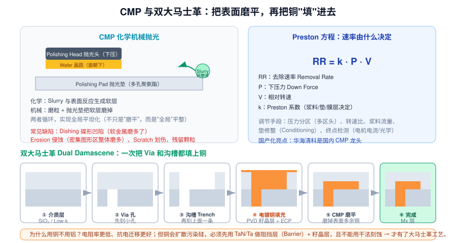
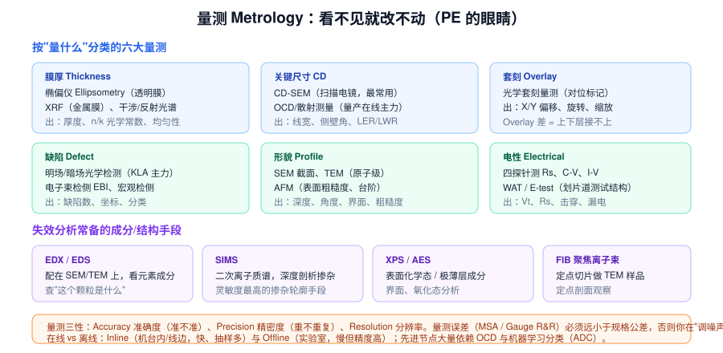

# 6 · CMP · 清洗 · 量测（2h）

> **学完你能做到**：解释 CMP 为什么能"全局"平坦化；说出双大马士革的六步；给不同量测需求选对工具；理解"量不准就没法改"的道理。

**关键词**：CMP / Slurry 研磨液 / Pad 抛光垫 / Conditioning / Preston 方程 / RR / Dishing / Erosion / 双大马士革 / Via / Trench / ECP 电镀 / Barrier 阻挡层 / 椭偏仪 / CD-SEM / OCD / Overlay / 四探针 / KLA / SIMS / TEM

---
> 🧑‍🏫 **人话速读**（看正文之前，先读这段）
>
> 相对轻松的一章，两件事：**CMP 把晶圆表面磨平**（像打磨地板，不平的话光刻就会糊）；**量测用各种"尺子"检查做得对不对**（看不见就改不动）。
> 记住 Preston 方程（压力 × 相对速度 = 磨得快慢）和双大马士革流程（先挖沟槽再填铜）就够用。

**本章黑话翻译表**（听到这些词别慌）

| 黑话 | 大白话 |
|---|---|
| CMP | 化学机械抛光：化学软化 + 机械磨掉 |
| Slurry 研磨液 | 提供化学作用的"药水" |
| Pad 抛光垫 | 提供机械摩擦的那块垫子 |
| Dishing 凹陷 | 铜磨得比旁边低，中间凹下去 |
| Erosion 侵蚀 | 密集区域整体被磨掉更多 |
| 双大马士革 | 做铜互连的标准流程：先挖孔和沟槽，再填铜 |
| CD-SEM | 用电子显微镜量线宽 |
| 椭偏仪 | 用光的偏振量薄膜厚度 |
| Overlay 量测 | 量上下两层对准偏差 |

---

## 6.1 CMP 化学机械抛光



### 为什么需要 CMP

光刻的 **DOF（焦深）极浅**。如果表面高低起伏大，后续曝光就会有的地方清楚有的地方糊。**CMP 是目前唯一能实现全局平坦化（Global Planarization）的手段**。

### 化学 + 机械的协同

1. **化学**：Slurry 研磨液中的氧化剂与表面反应，生成一层较软的反应层
2. **机械**：磨粒（如 SiO₂、CeO₂、Al₂O₃）+ 多孔聚氨酯抛光垫把软层磨掉
3. 循环往复 → 高处磨得快、低处磨得慢 → 整片变平

### Preston 方程（背下来）

```
RR = k · P · V
```
| 符号 | 含义 |
|---|---|
| RR | Removal Rate 去除速率 |
| P | Down Force 下压力 |
| V | 相对线速度（转速与半径） |
| k | Preston 系数（由浆料、抛光垫、膜层材料决定） |

**调节手段**：多区压力头（不同半径施加不同压力）、转速比、浆料流量、垫修整（Conditioning，用金刚石盘修整垫面维持粗糙度）、终点检测（电机电流变化/光学/涡流）

### CMP 的典型缺陷

| 缺陷 | 成因 |
|---|---|
| **Dishing 碟形凹陷** | 软金属（Cu）磨得比周围介质快，中间凹下去 |
| **Erosion 侵蚀** | 图形密集区整体被磨掉更多 |
| **Scratch 划伤** | 大颗粒、垫面异物、修整盘碎屑 |
| **Residue 残留** | 浆料残留、清洗不净 |
| **Within-die 不均匀** | 图形密度差异（所以需要 Dummy Fill 假图形） |

> 国产化亮点：**华海清科**是国内 CMP 设备龙头，CMP 也是国产设备替代进度最快的环节之一。

---

## 6.2 双大马士革 Dual Damascene

为什么需要它？**铜无法用干法刻蚀**（铜的卤化物挥发性差，刻不动），所以不能"先沉积铜再刻图形"，只能反过来：**先挖槽，再填铜，再磨平**。

| 步 | 做什么 |
|---|---|
| ① | 沉积介质层（SiO₂ 或 **Low-k 低介电常数材料**，降低寄生电容） |
| ② | 光刻 + 刻蚀出 **Via 通孔**（连通下层） |
| ③ | 再光刻 + 刻蚀出 **Trench 沟槽**（本层布线） |
| ④ | PVD 沉积 **Barrier 阻挡层（TaN/Ta）** + **Cu 籽晶层（Seed）** |
| ⑤ | **ECP 电镀铜**填充（要有超填充 Superfill 能力，避免空洞） |
| ⑥ | **CMP** 磨掉表面多余的铜与阻挡层 |

**关键**：Barrier 层是必须的——铜原子会扩散进硅和介质，造成深能级污染和漏电。

> 为什么用 Low-k？金属层间距变小后，线与线之间的寄生电容 RC 延迟成为速度瓶颈，降低介质 k 值可以减少延迟与功耗。

---

## 6.3 清洗（贯穿全程，补充）

每道主要工序前后几乎都要洗。核心指标是**去除效率 vs 损伤/粗糙度**的平衡。

- **单片清洗**（Spin Clean）vs **槽式批量清洗**（Wet Bench）
- 先进节点多用单片（控制精度高、交叉污染小）
- 干燥很关键：水印（Watermark）本身就是缺陷 → Marangoni 干燥、IPA 蒸汽干燥

---

## 6.4 量测：看不见就改不动



### 按"量什么"选工具

| 量什么 | 用什么 | 输出 |
|---|---|---|
| **膜厚**（透明膜） | 椭偏仪 Ellipsometry | 厚度、折射率 n、消光系数 k |
| **膜厚**（金属膜） | XRF、四探针 | 厚度、方块电阻 |
| **CD 线宽** | CD-SEM / OCD 散射测量 | 线宽、侧壁角、LER/LWR |
| **Overlay 套刻** | 光学套刻量测 | X/Y 平移、旋转、缩放、畸变 |
| **缺陷** | 明场/暗场光学检测、EBI 电子束 | 缺陷数量、坐标、分类 |
| **形貌** | SEM 截面、TEM、AFM | 深度、角度、界面、粗糙度 |
| **电性** | 四探针、C-V、I-V、WAT | Rs、Vt、击穿电压、漏电 |

### 在线 vs 离线

- **Inline 在线**：速度快、抽样多，用于实时监控（OCD、光学缺陷检测）
- **Offline 离线**：慢但精度高（TEM、SIMS、AFM），用于根因分析

### 量测三性（必背）

| 概念 | 含义 |
|---|---|
| **Accuracy 准确度** | 测出来跟真值差多少 |
| **Precision 精密度** | 重复测同一点，结果稳不稳 |
| **Resolution 分辨率** | 能分辨多小的差异 |

> **Gauge R&R / MSA（量测系统分析）**：如果量测本身的误差接近规格公差的 1/10 以上，你在调的就是噪声。这是 PE 最容易踩的坑之一——**先确认量测可信，再动手改工艺**。

### 失效分析常用的成分/结构手段

| 手段 | 用途 |
|---|---|
| **EDX / EDS** | 配在 SEM/TEM 上，看"这个颗粒是什么元素" |
| **SIMS** | 二次离子质谱，做掺杂浓度随深度的剖析，灵敏度最高 |
| **XPS / AES** | 表面化学态、极薄层成分 |
| **FIB** | 聚焦离子束定点切片，做 TEM 样品或定点剖面 |

---

## 6.5 章末自测

1. 为什么需要 CMP？只有涂胶那种"回流平坦化"不行吗？
2. Preston 方程是什么？三个变量分别怎么调节？
3. Dishing 和 Erosion 的区别？
4. 为什么铜不能用干法刻蚀？因此发明了什么工艺？
5. 双大马士革的六个步骤？
6. Barrier 阻挡层的作用是什么？
7. 为什么要引入 Low-k 介质？
8. 量透明膜厚度用什么？量金属膜用什么？
9. CD-SEM 和 OCD 各有什么优缺点？
10. Overlay 差会导致什么后果？
11. Accuracy、Precision、Resolution 分别是什么？
12. 什么叫 Gauge R&R？为什么改工艺前要先确认量测？

---

## 6.6 延伸（可选，15 分钟）

- 查"Superfill / Bottom-up Fill"原理（铜电镀为什么能无空洞填充）
