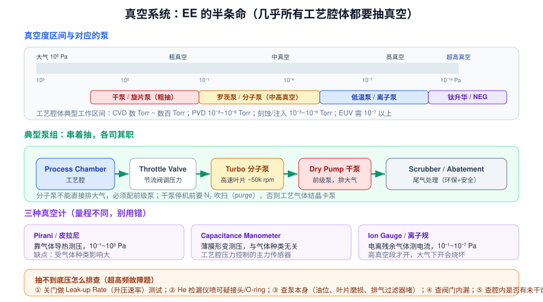
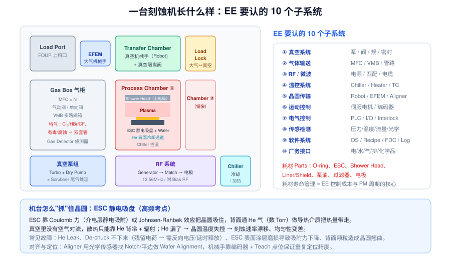

# 06 · 真空与设备硬件基础（3.5h，EE 核心）

> **学完你能做到**：说出真空度区间和对应的泵；讲清泵组怎么串；解释 ESC 怎么固定晶圆、为什么要通 He；被问"抽不到底压怎么排查""RF 反射功率高怎么排查"时给出清晰顺序。

**关键词**：真空度 / Torr·Pa / 粗真空·高真空 / Dry Pump / Turbo 分子泵 / Cryo 低温泵 / Throttle Valve / Pirani / Cap Manometer / Ion Gauge / Leak Rate / He 检漏 / ESC / He 背冷 / MFC / VMB / RF 13.56MHz / Match / ESC / FOUP / EFEM / Load Lock / OHT / PLC / Interlock / Servo

---

## 6.1 真空：为什么 Fab 离不开它

**三个目的**
1. 排除空气（O₂、H₂O、N₂）干扰化学反应 → 保证膜纯度与界面质量
2. 让气体分子平均自由程足够长 → 离子/原子能"直线飞行"（PVD、注入）
3. 让等离子体稳定存在（气压决定电离率与碰撞频率）

### 真空度单位与区间



| 区间 | 压力范围 | 用途 |
|---|---|---|
| 粗真空 | 10⁵ ~ 10² Pa | 粗抽、Load Lock |
| 中真空 | 10² ~ 10⁻¹ Pa | 部分 CVD、传输腔 |
| 高真空 | 10⁻¹ ~ 10⁻⁷ Pa | PVD、刻蚀、注入 |
| 超高真空 UHV | < 10⁻⁷ Pa | EUV、表面分析、MBE |

**单位换算**：1 Torr ≈ 133.3 Pa；1 atm = 760 Torr ≈ 101325 Pa。Fab 里 Torr、mTorr、Pa 混用，注意别搞错。

---

## 6.2 泵：各有各的活法

| 泵 | 原理 | 工作区间 | 特点 |
|---|---|---|---|
| **旋片泵 / 油泵** | 机械容积变化 | 粗真空 | 便宜，但油可能返流污染 |
| **Dry Pump 干泵** | 螺杆/爪式/涡旋，无油 | 粗~中真空 | **Fab 主力**，耐腐蚀、无油污染，需 N₂ 吹扫 |
| **Roots 罗茨泵** | 两个"8"字转子 | 中真空 | 常做增压泵 |
| **Turbo 分子泵** | 高速叶片把动量传给气体分子，~50k rpm | 高真空 | **不能直接排大气，必须配前级泵** |
| **Cryo 低温泵** | 低温冷板冷凝/吸附气体 | 高真空~UHV | 抽速大、无振动，需定期再生 |
| **Ion Pump 离子泵** | 电离后由电场捕获 + 钛溅射吸附 | UHV | 无运动部件、极干净，用于 EUV/注入 |

### 典型泵组串联（背下来）

```
Process Chamber → Throttle Valve 节流阀 → Turbo 分子泵 → Dry Pump 干泵 → Scrubber 尾气处理 → 排大气
```

- **节流阀**是工艺压力的控制元件（不是泵本身）
- **分子泵不能直接排大气**，必须配前级泵（Backing Pump）
- **干泵停机前必须 N₂ 吹扫（Purge）**，否则工艺气体在泵内结晶/腐蚀导致卡泵
- **Scrubber / Abatement**：燃烧+水洗处理有毒/温室气体（PFC、Cl₂、SiH₄ 等），环保与安全强制要求

### 三种真空计（量程不同，别用错）

| 类型 | 原理 | 量程 | 注意 |
|---|---|---|---|
| **Pirani 皮拉尼** | 气体导热能力随压力变化 | 10⁻¹ ~ 10³ Pa | 受气体种类影响大，需按气体标定 |
| **Capacitance Manometer 电容薄膜规** | 薄膜形变 | 宽 | **与气体种类无关**，工艺腔压力控制主力 |
| **Ion Gauge 离子规** | 电离残余气体测离子流 | 10⁻¹ ~ 10⁻⁷ Pa | **大气压下开机必烧坏**，只在真空建立后开 |

---

## 6.3 机台解剖：EE 要认的 10 个子系统



| # | 子系统 | 内容 | 常见故障 |
|---|---|---|---|
| ① | **真空** | 泵、阀、规、密封 | 抽不到底压、Leak、泵卡死 |
| ② | **气体输送** | MFC、VMB、管路、气动阀 | 流量不准、阀内漏、堵塞 |
| ③ | **RF / 微波** | Generator、Match、电缆 | 反射功率高、点不着等离子体 |
| ④ | **温控** | Chiller、Heater、热电偶 | 温度漂移、He 泄漏 |
| ⑤ | **晶圆传输** | Robot、EFEM、Aligner | 定位漂移、掉片、划伤 |
| ⑥ | **运动控制** | 伺服电机、编码器、导轨 | 超行程、异响、重复精度差 |
| ⑦ | **电气控制** | PLC、I/O、Interlock、继电器 | 传感器误报、安全链断开 |
| ⑧ | **传感检测** | 压力/温度/流量/光学/电流 | 漂移、老化、污染 |
| ⑨ | **软件** | OS、Recipe、FDC、Log、SECS/GEM | 死机、通讯中断 |
| ⑩ | **厂务接口** | 电、CDA、PCW、工艺冷却水、排气、化学品 |  供给中断导致全线 Down |

**厂务（Facility）缩写速记**：
- **CDA** 洁净干燥压缩空气（驱动气动阀）
- **PCW** 工艺冷却水；**Chiller** 冷冻机
- **UPW** 超纯水；**DIW** 去离子水
- **Exhaust** 排气；**Scrubber** 尾气处理
- **N₂ / O₂ / Ar / He / H₂** 大宗气体

---

## 6.4 ESC 静电吸盘：真空里怎么"抓"住晶圆（高频考点）

**为什么需要**：真空里不能用真空吸盘（没气压差），机械夹持会损伤和遮挡。

**原理**：
- **Coulomb 型**：介电层内的电荷与晶圆感应电荷之间的静电引力
- **Johnsen-Rahbek（JR）型**：介电层有一定导电性，电荷贴近表面，吸力更大

**He 背面冷却（Backside Cooling）**：
- 真空里没有空气对流，晶圆散热只能靠**热传导 + 辐射**
- 在 ESC 表面与晶圆背面之间通入数 Torr 的 **He 气**作为导热介质
- **He 泄漏 → 晶圆温度失控 → 刻蚀速率漂移、均匀性变差**

**常见故障**
| 现象 | 可能原因 |
|---|---|
| De-chuck 放不下来 | 残留电荷 → 需反向电压或延时释放 |
| 吸附力下降 | 表面涂层磨损、污染 |
| 温度不均 | He 泄漏、He 通道堵塞、ESC 表面积垢 |
| 晶圆背面颗粒 | ESC 表面脏、He 吹扫带出颗粒 |

---

## 6.5 气体输送：MFC 是核心

- **MFC 质量流量控制器**：直接控制**质量流量**（sccm），而非体积流量。内部是热式或压力式传感 + 比例阀闭环
- **VMB 多路阀箱**：把一路气源分成多路，供给不同机台/腔体
- **特气安全**：Cl₂、HBr、SiH₄、NH₃、WF₆ 等有毒/易燃/腐蚀性气体 → **双套管**、**气柜负压**、**气体侦测器**、**自动切断**

**MFC 流量不准怎么排查（高频题）**
1. 看 MFC 设定值与反馈值是否一致（闭环能否跟上）
2. 检查上游供气压力是否足够（压力不足 → 阀全开也到不了设定值）
3. 检查管路是否堵塞/泄漏
4. 做 **MFC 标定**（用标准流量计或 Rate-of-Rise 法）
5. 检查气体种类设置是否正确（MFC 有气体换算因子 CF）

---

## 6.6 晶圆传输与自动化

| 概念 | 含义 |
|---|---|
| **FOUP** | Front Opening Unified Pod，装 25 片晶圆的密闭盒 |
| **Load Port** | 机台上放 FOUP 的接口 |
| **EFEM** | Equipment Front End Module，大气侧的前端模块，内含机械手 |
| **Load Lock** | 大气↔真空的过渡腔，避免主腔体暴露大气 |
| **Transfer Chamber** | 真空传输腔，内含真空机械手，连接多个工艺腔 |
| **OHT / AMHS** | 天车/自动物料搬运系统，在 Fab 天花板轨道上运送 FOUP |
| **Aligner** | 寻边器，用光学传感器找 Notch/平边，确定晶圆角度 |
| **Robot Teach** | 机械手点位示教，决定重复定位精度 |

**机械手的定位**：伺服电机 + 编码器闭环；靠 Teach 点位 + 传感器反馈。定位漂移常见原因是皮带松、编码器脏、导轨磨损、机械手手臂变形。

---

## 6.7 三个"抽不到底压 / 排障"标准流程（背下来）

### A. 腔体抽不到底压（Base Pressure 不达标）

1. **关门做 Leak-up Rate（升压速率）测试**：抽到极限后关阀隔离，看压力上升速率 → 判断是漏气还是放气（Outgassing）
2. **He 检漏仪喷可疑点**：接头、O-ring、法兰、视窗、馈通
3. **查泵本身**：干泵油位/叶片磨损/排气过滤器堵；分子泵转速是否正常、有无异响
4. **查阀门内漏**：单独隔离每段管路测压力
5. **查腔内污染**：残留水汽（未干燥）、聚合物、上次 PM 未装好

### B. RF 反射功率高

1. 看匹配器电容位置是否异常（是否到极限、是否卡死/磨损）
2. 检查电缆与接头（松动、烧蚀、进水）
3. 检查腔体状态（腔壁沉积物改变阻抗、气压异常、气体配比错）
4. 检查等离子体是否真的点着
5. 用 V/I 探头看谐波，判断腔体等效阻抗变化

### C. 颗粒（Particle）超标

1. 确认量测：颗粒计数器是否校准、取样位置
2. 看时间相关性：是否跟某次 PM 之后、某个 Parts 更换之后相关
3. 看空间分布：片内分布图（边缘？中心？随机？）能定位来源
4. 查传输路径：机械手、Load Lock、EFEM 气流、FOUP 洁净度
5. 查腔体：腔壁沉积物厚度、Parts 寿命、静电吸附

---

## 6.8 章末自测

1. 高真空和超高真空的压力范围分别是多少？
2. 分子泵能直接排大气吗？它需要什么配合？
3. 典型泵组从腔体到大气依次经过哪些部件？
4. Pirani、电容薄膜规、离子规分别适用什么量程？使用注意？
5. 干泵停机前为什么要 N₂ 吹扫？
6. ESC 靠什么力吸住晶圆？为什么要通 He？
7. He 泄漏会导致什么后果？
8. MFC 控制的是质量流量还是体积流量？流量不准怎么排查？
9. FOUP、EFEM、Load Lock、Transfer Chamber 分别是什么？
10. 抽不到底压的标准排查顺序是什么？
11. RF 反射功率高说明什么？怎么排查？
12. 颗粒超标的空间分布图能给你什么线索？

---

## 6.9 延伸（可选，20 分钟）

- 查"SEMI 标准"有哪些（SEMI S2 安全、SEMI E10 设备可靠性），感受一下行业规范体系
