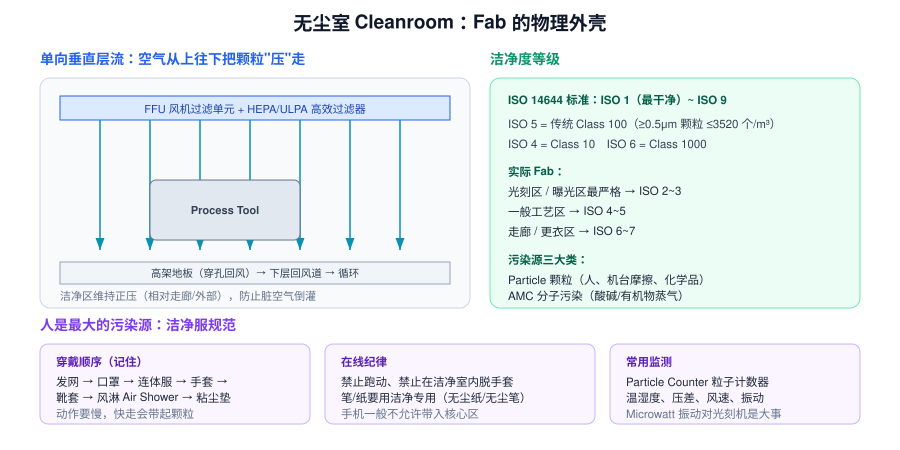

# 8 · 无尘室与生产运作（1.5h）

> **学完你能做到**：解释洁净度等级；说清 Fab 的气流与压差逻辑；理解 MES / Lot / Recipe 这套生产语言；知道 Throughput、Cycle Time、WIP 的含义和相互关系。

**关键词**：Cleanroom / ISO 14644 / Class 100 / HEPA·ULPA / FFU / 层流 / 正压 / AMHS·OHT / MES / CIM / Lot / Recipe / FOUP / Throughput / Cycle Time / WIP / Bottleneck / FDC / APC / R2R

---
> 🧑‍🏫 **人话速读**（看正文之前，先读这段）
>
> 轻松的一章，讲两件事：**无尘室为什么这么设计**（正压 + 垂直层流，把灰尘往外顶），以及 **Fab 里那套生产语言**（Lot、Recipe、Throughput、Cycle Time）。
> 面试问"怎么理解 Cycle Time"时，能说出它和 WIP 的关系就够了：在线上堆的活越多，出货就越慢。

**本章黑话翻译表**（听到这些词别慌）

| 黑话 | 大白话 |
|---|---|
| Class 100 / ISO 5 | 洁净度等级，数字越小越干净 |
| HEPA / ULPA | 高效空气过滤器，挡住颗粒 |
| FFU | 天花板上带风扇的过滤单元，负责吹风 |
| 正压 | 干净区压力更高，脏空气进不来 |
| MES | 管生产的软件系统，派工和记录都靠它 |
| Recipe | 机台的"菜谱"，一组工艺参数 |
| Throughput | 每小时能做多少片 |
| WIP | 在制品，线上积压的数量 |
| Bottleneck | 瓶颈机台，整条线的产能由它决定 |
| FDC | 实时盯机台传感器数据的系统 |

---

## 8.1 无尘室：Fab 的物理外壳



### 洁净度等级

**ISO 14644 标准**：ISO 1（最干净）~ ISO 9。看的是单位体积内 ≥某粒径的颗粒数。

| 习惯叫法 | ISO 等级 | Fab 里的位置 |
|---|---|---|
| Class 10 | ISO 4 | 一般工艺区 |
| Class 100 | ISO 5 | 工艺区常见等级 |
| Class 1000 | ISO 6 | 走廊、更衣区 |
| — | ISO 2~3 | **光刻/曝光区**（最严格） |

**Fab 分区**：光刻区最严格 → 一般工艺区 → 走廊 → 更衣区 → 外部。逐级压差递减，空气从干净区流向较脏区。

### 单向垂直层流

```
FFU（风机 + HEPA/ULPA 高效过滤器）在天花板
        ↓  空气垂直向下，把颗粒"压"下去
    工艺机台
        ↓
   高架地板（穿孔）→ 下层回风道 → 循环过滤
```

**关键点**：
- 洁净区维持**正压**（相对外部），防止脏空气倒灌
- 空气要经过 HEPA（99.97% @ 0.3μm）或 ULPA（99.999% @ 0.12μm）
- **换气次数**：每小时几十到几百次

### 污染源三大类

| 类型 | 来源 |
|---|---|
| **Particle 颗粒** | **人是最大来源**（皮屑、纤维）、机台摩擦、化学品结晶、包装材料 |
| **AMC 分子污染** | 酸碱蒸气、有机物挥发，会腐蚀或改变表面性质 |
| **静电 ESD** | 吸附颗粒、击穿器件 |

### 洁净室纪律（进厂第一周就会考）

- 穿戴顺序：**发网 → 口罩 → 连体服（Bunny Suit）→ 手套 → 靴套 → 风淋 Air Shower → 粘尘垫**
- 不能跑动（快走会带起颗粒），动作要慢
- 用**洁净专用**纸笔、无尘布
- 手机通常不允许带入核心区
- 进出一次 Cleanroom 要 10 分钟起

---

## 8.2 Fab 的生产语言

| 概念 | 含义 |
|---|---|
| **Lot** | 一批晶圆，通常 25 片（一个 FOUP） |
| **Wafer / Slot** | 一片晶圆 / 在盒里的槽位编号（1~25） |
| **Wafer ID** | 每片晶圆激光刻的唯一编号，全程可追溯 |
| **Recipe** | 机台跑某工序的参数集合（PE 的核心资产） |
| **Flow / Route** | 完整工艺流程 |
| **MES / CIM** | 制造执行系统 / 计算机集成制造，控制工单流转、记录所有数据 |
| **EDC / SPC 系统** | 采集量测数据并做统计监控 |
| **FDC** | Fault Detection and Classification，实时采集机台传感器数据（秒级）做异常检测 |
| **APC / R2R** | 先进过程控制 / Run-to-Run 控制：根据上一批结果自动微调下一批参数 |
| **AMHS / OHT** | 自动物料搬运 / 天车系统 |
| **Stocker** | 晶圆盒暂存仓库 |

### 三个产能指标

| 指标 | 含义 | 关系 |
|---|---|---|
| **Throughput / WPH** | 机台每小时处理多少片 | 决定单台产能 |
| **Cycle Time** | 一片从投料到出厂的总时间 | 先进逻辑约 **2~3 个月** |
| **WIP** | 在制品数量 | 利特尔法则：**WIP = Throughput × Cycle Time** |

**Bottleneck 瓶颈机台**：产能最小的那道工序决定了整条线的产出。通常是**光刻**（尤其 EUV，机台贵且慢）或某些耗时长的刻蚀/薄膜工序。

**OEE 对产能的影响**：一台 Uptime 只有 60% 的机台，等于产能直接打六折 → 这就是 EE 的价值所在。

---

## 8.3 数据系统：Fab 是数据密集行业

```
机台传感器（秒级）→ FDC → 报警/趋势
        ↓
量测数据（每批）→ EDC → SPC 控制图 → 异常判定
        ↓
电测/WAT/CP → 良率系统 → Bin Map / 良率分析
        ↓
MES 贯穿全程：工单、配方版本、人员操作、物料追溯
```

**为什么强调数据**：Fab 里几乎所有决策都要有数据支撑。面试时说"我会先看趋势数据再下判断"比"我会去现场看看"加分得多。

---

## 8.4 章末自测

1. ISO 5 对应传统的什么等级？Fab 里哪个区最严格？
2. 无尘室的气流方向？为什么洁净区要维持正压？
3. 洁净室三大污染源是什么？最大的人为来源是什么？
4. 进入无尘室的穿戴顺序？
5. 一个 FOUP 通常装多少片晶圆？
6. Recipe 是什么？谁负责它？
7. MES 起什么作用？
8. FDC 和 SPC 的数据粒度有什么不同？
9. Throughput、Cycle Time、WIP 三者的关系（利特尔法则）？
10. 为什么光刻常常是 Bottleneck？

---

## 8.5 延伸（可选，15 分钟）

- 查"Fab 厂务系统"：超纯水、特气站、变电站、废水处理，了解一座 Fab 的基建复杂度
