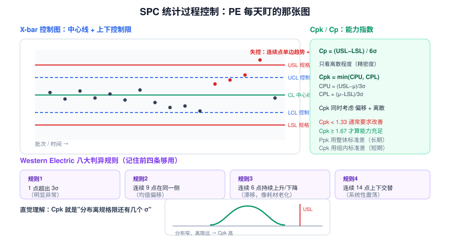
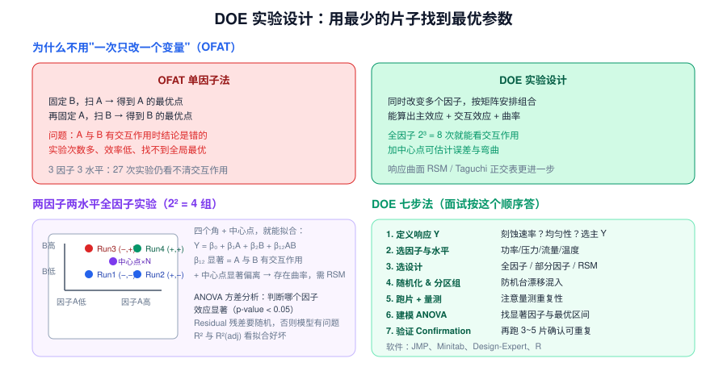
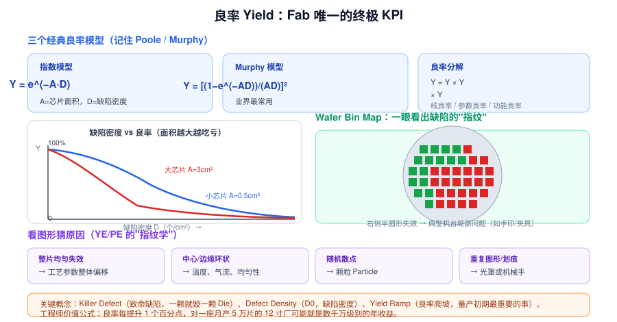

# 09 · 工艺工程方法论（3.5h，PE 核心）

> **学完你能做到**：看懂控制图并说出判异规则；算得出/讲得清 Cpk；设计一个 DOE；解释良率模型与 Bin Map；被问"良率掉了怎么办"时给出完整流程。

**关键词**：SPC / 控制图 / UCL·LCL / USL·LSL / 判异规则 / Cp / Cpk / Ppk / DOE / 全因子 / 部分因子 / RSM / ANOVA / 主效应 / 交互作用 / 随机化 / Yield / Murphy 模型 / Defect Density / Bin Map / Killer Defect / 8D / CAR / Hold / Disposition / Scrap / Rework

---

## 9.1 SPC 统计过程控制



### 控制图的两组线（别搞混）

| 线 | 英文 | 依据 | 含义 |
|---|---|---|---|
| **CL** 中心线 | Center Line | 目标值/历史均值 | 应该围绕它波动 |
| **UCL / LCL** 控制限 | Control Limit | **μ ± 3σ（由过程本身算出）** | 判断过程是否"稳定" |
| **USL / LSL** 规格限 | Spec Limit | **由产品设计要求给定** | 判断产品是否"合格" |

> **核心认知**：控制限 ≠ 规格限。过程稳定（在控制限内）不代表产品合格（可能在规格限外）。

### 判异规则（Western Electric，记住前四条够用）

| 规则 | 条件 | 说明 |
|---|---|---|
| 1 | 1 点超出 3σ | 明显异常 |
| 2 | 连续 9 点在同一侧 | 均值偏移 |
| 3 | 连续 6 点持续上升/下降 | **漂移**（典型：耗材老化、腔体沉积） |
| 4 | 连续 14 点上下交替 | 系统性震荡（典型：两腔交替、自动补偿过冲） |

### 过程能力指数

```
Cp  = (USL − LSL) / 6σ                     ← 只看离散（精密度）
CPU = (USL − μ) / 3σ
CPL = (μ − LSL) / 3σ
Cpk = min(CPU, CPL)                        ← 同时考虑偏移 + 离散
```

| Cpk | 评价 |
|---|---|
| < 1.0 | 不合格，会产生不良 |
| 1.0 ~ 1.33 | 勉强，通常需要改善 |
| **≥ 1.33** | 一般要求门槛 |
| **≥ 1.67** | 能力充足 |
| ≥ 2.0 | 六西格玛水平 |

**Cpk vs Ppk**：Cpk 用**组内标准差**（短期能力）；Ppk 用**整体标准差**（长期表现）。量产爬坡看 Ppk，过程能力评估看 Cpk。

> **直觉理解**：Cpk 就是"分布离最近的规格限还有几个 σ"。Cpk = 1.33 意味着最近的规格限在 4σ 处。

### SPC 的局限

- SPC 是**事后**发现（等量测数据出来）
- 所以才有 **FDC**（秒级机台数据）与 **APC/R2R**（自动微调）作为补充

---

## 9.2 DOE 实验设计



### 为什么不用 OFAT（一次改一个变量）

| | OFAT | DOE |
|---|---|---|
| 交互作用 | **看不见**，结论可能错 | 能算出交互效应 |
| 实验次数 | 多 | 少（2³ 全因子只要 8 次） |
| 全局最优 | 找不到 | 可建响应面找最优 |

### 关键概念

- **因子 Factor**：要研究的输入变量（功率、压力、流量、温度）
- **水平 Level**：每个因子取的几个值（高/低，或 −1/+1）
- **响应 Response (Y)**：输出指标（刻蚀速率、均匀性、Cpk…）
- **主效应 Main Effect**：单个因子对 Y 的平均影响
- **交互效应 Interaction**：一个因子的效果依赖于另一个因子的水平
- **随机化 Randomization**：打乱实验顺序，防止机台漂移混入结论
- **区组 Blocking**：把已知干扰（如不同机台、不同天）作为区组分离
- **中心点 Center Point**：估计纯误差与曲率

### 2² 全因子设计示例

| Run | A（功率） | B（压力） |
|---|---|---|
| 1 | − | − |
| 2 | + | − |
| 3 | − | + |
| 4 | + | + |
| + 中心点 ×N | 0 | 0 |

拟合模型：`Y = β₀ + β₁A + β₂B + β₁₂AB`
- β₁₂ 显著 → **A 与 B 有交互作用**
- 中心点显著偏离角点平均 → **存在曲率**，需要响应曲面 RSM

### ANOVA 方差分析

判断哪些因子的效应**统计显著**（p-value < 0.05）。同时看：
- **R² / R²(adj)**：模型拟合好坏
- **残差 Residual**：应该随机分布；有规律说明模型缺项

### DOE 七步法（面试按这个顺序答）

1. **定义响应 Y**（选主 Y，别一次想优化所有指标）
2. **选因子与水平**（基于机理与经验定范围）
3. **选设计类型**（全因子 / 部分因子筛选 / RSM 优化）
4. **随机化与区组**（防漂移混入）
5. **跑片 + 量测**（注意量测重复性）
6. **建模与 ANOVA**（找显著因子与最优区间）
7. **验证 Confirmation run**（再跑 3~5 片确认可重复）

常用软件：**JMP、Minitab、Design-Expert、R**。

> **面试加分**：主动说"我会先做筛选设计（Screening）把因子从 10 个筛到 3 个，再做 RSM 找最优，最后做确认实验"——这显示你知道 DOE 是有阶段Cost的。

---

## 9.3 良率 Yield



### 三个经典模型

| 模型 | 公式 | 说明 |
|---|---|---|
| 指数模型 | `Y = e^(−A·D)` | 最简，假设缺陷随机均匀分布 |
| **Murphy 模型** | `Y = [(1−e^(−AD))/(AD)]²` | **业界最常用**，考虑缺陷密度分布不均 |
| Bose-Einstein | `Y = 1/(1+AD)^m` | 考虑缺陷聚簇 |

- **A** = 芯片面积（Die Area）
- **D** = 缺陷密度（Defect Density，个/cm²）
- 面积越大 → 良率越低（这是大芯片贵的核心原因之一）

### 良率分解

```
总良率 Y = Y_line（线良率）× Y_parametric（参数良率）× Y_functional（功能良率）
```

- **线良率**：有没有物理缺陷（颗粒、短路、开路）
- **参数良率**：电性参数（Vt、Rs、速度）是否落在规格内
- **功能良率**：CP/FT 测试是否通过

### Wafer Bin Map：缺陷的"指纹学"

| 图形 | 可能原因 |
|---|---|
| **整片均匀失效** | 工艺参数整体偏移 |
| **中心/边缘环状** | 温度场、气流、均匀性问题 |
| **随机散点** | 颗粒 Particle |
| **重复图形（Repeating）** | 光罩缺陷或步进场问题 |
| **划痕/Scratch** | 机械手、传输路径 |
| **半边失效** | 机台局部问题（夹具、手印、喷嘴） |
| **边缘一圈失效** | 边缘效应（涂胶、CMP、夹持） |

### 关键概念

- **Killer Defect 致命缺陷**：一颗就毁掉一颗 Die 的缺陷
- **D0 缺陷密度**：由测试结构（如梳状/蛇形结构）标定
- **Yield Ramp 良率爬坡**：量产初期最重要的事，通常要几个月到一年爬到目标
- **Pareto 分析**：把缺陷按类型排序，先解决 Top 20% 贡献 80% 的那几个

---

## 9.4 异常处理的标准流程（PE 版）

1. **发现**：SPC 报警 / 量测超标 / 缺陷数跳变 / FDC 异常
2. **遏制**：**Hold Lot**（在 MES 里冻结批次），必要时停机台
3. **信息收集**：哪台机、哪批货、什么时候开始、影响范围（往前追到上次 OK 的时间点）
4. **数据交叉**：量测数据 + FDC Trace + PM/Parts 更换记录 + 上游来料情况
5. **对照实验**：换机台确定 EE/PE 归属；查是否是上游来料问题（**这是最常被忽略的一步**）
6. **根因分析**：5Why + 鱼骨图
7. **处置 Disposition**：对已产出的晶圆做判定
   - **Pass 放行** / **Rework 返工** / **Scrap 报废** / **特采（Deviation/Waiver）**
8. **对策与验证**：改 Recipe / 改 PM / 换 Parts → 跑片验证
9. **闭环**：8D / CAR，横向展开，改 SOP

> **新手最容易犯的错**：只查自己这一站，忘了看**上游来料**。实际异常中有相当比例是上游造成的。

---

## 9.5 工艺变更与风险管理

| 概念 | 说明 |
|---|---|
| **ECN / ECR** | 工程变更通知 / 申请，任何 Recipe 或流程改动都要走 |
| **Qualification (Qual)** | 变更后必须跑验证片，确认指标与可靠性都合格 |
| **Split Lot** | 把一批货分成两半，一半走旧条件一半走新条件做对照 |
| **FMEA** | 变更前评估风险 |
| **Reliability Test** | 变更后需做可靠性验证（HTOL、EM、TDDB、HCI 等） |
| **Marathon** | 长期稳定性验证 |

**PE 的金科玉律**：**任何变更都要有数据支撑，都要验证，都要记录。** 无记录的改动 = 事故。

---

## 9.6 面试高频情景题

**Q：良率突然掉了 5 个点，你怎么处理？**

> 1. **确认数据**：先看是不是量测/测试的问题（Gauge R&R、测试机异常）
> 2. **定位时间**：什么时候开始掉？那天改过什么？（Recipe、Parts、PM、材料批次、人员）
> 3. **定位空间**：Bin Map 是什么形状？集中在哪片、哪个位置、哪个 Lot？
> 4. **定位层级**：缺陷分类 Pareto → 是颗粒？桥连？参数漂移？
> 5. **定位站点**：用 WAT/电性数据反推是哪个模块；查上游来料
> 6. **对照实验**：Split Lot 换机台
> 7. **根因 + 对策 + 验证**：5Why → 对策 → 跑片验证 → 8D 闭环 → 横向展开

**Q：Cpk 只有 1.0，怎么提升？**

> Cpk = min(CPU, CPL)。两个方向：
> - **中心偏移**（μ 不在规格中心）→ 调靶值（Retarget），这是最容易的一步
> - **离散太大**（σ 大）→ 找波动来源：机台间差异（做 Chamber Matching）、片内均匀性（调气流/温度/压力）、批次间（材料/PM 周期）
> - 若规格本身太紧 → 与 PIE/设计侧沟通能否放宽（需评估影响）

**Q：你要优化一个刻蚀工艺，怎么安排实验？**

> 1. 定义 Y：刻蚀速率 + 均匀性 + 选择比（选主 Y，其余做约束）
> 2. 选因子：功率、压力、气体流量比、温度（4 个）
> 3. 先做**筛选设计**（如 2⁴⁻¹ 部分因子 + 3 个中心点，8+3=11 次），筛出 2~3 个显著因子
> 4. 再做 **RSM 响应曲面**（如 CCD 中心复合设计），找最优区间与曲率
> 5. **随机化 + 区组**（防机台漂移）
> 6. ANOVA 找显著项，检查残差
> 7. **确认实验**跑 3~5 片，确认可重复且 Cpk 达标

---

## 9.7 章末自测

1. 控制限和规格限的区别？过程稳定就等于产品合格吗？
2. Western Electric 判异规则的前四条？
3. Cp 和 Cpk 的区别？Cpk 1.33 是什么意思？
4. Cpk 和 Ppk 的区别？
5. 为什么 OFAT 会漏掉交互作用？
6. 2² 全因子有几次实验？加中心点的目的是什么？
7. 什么是主效应、交互效应？
8. DOE 为什么要随机化？
9. Murphy 良率模型公式？A 和 D 分别代表什么？
10. Bin Map 上"随机散点"和"重复图形"分别指向什么原因？
11. 良率可以分解成哪三部分？
12. 什么是 Killer Defect？什么是 Yield Ramp？
13. Disposition 有哪几种判定？
14. 异常处理流程里，新手最容易漏掉哪一步？
15. Cpk 只有 1.0，从哪两个方向提升？

---

## 9.8 延伸（可选，20 分钟）

- 手算一道 Cpk：已知 USL=105、LSL=95、μ=100.5、σ=1.2，求 Cpk（答案约 1.25）
- 查"六西格玛 DMAIC"流程，理解定义-测量-分析-改善-控制的闭环
