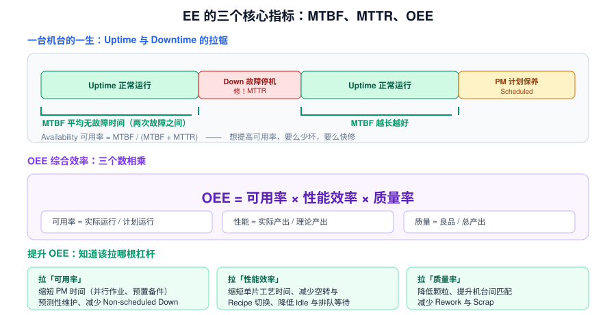
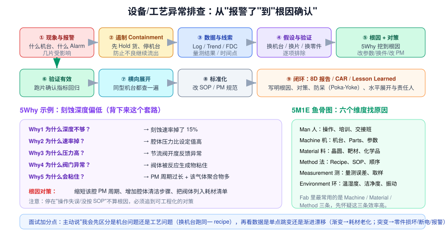

# 9 · 设备工程方法论（3h，EE 核心）

> **学完你能做到**：解释 MTBF/MTTR/OEE 并知道怎么提升；讲清 PM 体系与机台验收流程；被问"多台机台同时宕机你怎么排优先级""深夜机台报警你怎么办"时给出成熟答案。

**关键词**：MTBF / MTTR / Uptime / Availability / OEE / PM 预防保养 / PdM 预测维护 / FDC / Alarm / Log / Interlock / 备件 Spare Parts / Second Source / Buyoff 验收 / Qualification / Marathon / 8D / 5Why / FMEA / LOTO / SEMI

---
> 🧑‍🏫 **人话速读**（看正文之前，先读这段）
>
> 这章讲 EE 的**工作方法论**：机器好坏怎么衡量（MTBF / MTTR / OEE）、怎么保养（PM）、出问题怎么系统排查（8D / 5Why / 鱼骨图）。
> **不用背公式，重点是思路**：先确认现象 → 看数据 → 分层隔离变量 → 验证根因 → 标准化防再发。面试给情景题，考的就是这套结构化思维。

**本章黑话翻译表**（听到这些词别慌）

| 黑话 | 大白话 |
|---|---|
| MTBF | 平均多久坏一次，越长越好 |
| MTTR | 平均修多久，越短越好 |
| Availability 稼动率 | MTBF ÷ (MTBF + MTTR)，机器可用时间占比 |
| OEE | 综合效率 = 稼动率 × 性能 × 良品率 |
| PM 预防保养 | 不等坏了才修，按周期换耗材、清洁、校准 |
| Spare Parts | 备件，缺了就停机等料 |
| Buyoff / Qualification | 新机台验收，确认和老机台做得一样 |
| 8D | 八步法，写改善报告的标准格式 |
| 5Why | 连问五个为什么，挖出真根因 |
| FMEA | 提前列出可能失效模式并预防 |
| LOTO | 上锁挂牌，检修时的安全红线 |

---

## 9.1 三个核心指标

> 🧑‍🏫 **人话**：机器好不好，就用三个数字说话：**多久坏一次（MTBF）、修多久（MTTR）、综合利用率（OEE）**。EE 做的所有事，最后都要落到让这三个数字变好上，写简历、写报告也用这套语言。



| 指标 | 定义 | 方向 |
|---|---|---|
| **MTBF** 平均无故障时间 | 两次故障之间的平均运行时间 | 越长越好 |
| **MTTR** 平均修复时间 | 从故障发生到恢复的平均时间 | 越短越好 |
| **Availability 可用率** | MTBF / (MTBF + MTTR) | 越高越好 |
| **OEE 综合效率** | 可用率 × 性能效率 × 质量率 | 越高越好 |

### OEE 三要素与对应杠杆

| 要素 | 定义 | 提升手段 |
|---|---|---|
| **可用率 Availability** | 实际运行时间 / 计划运行时间 | 缩短 PM 时间（并行作业、预置备件）、预测性维护、减少非计划停机 |
| **性能效率 Performance** | 实际产出 / 理论产出 | 缩短单片工艺时间、减少 Idle 与换线、优化调度、减少 Dummy/Monitor 片占用 |
| **质量率 Quality** | 良品数 / 总产出 | 降颗粒、提升机台间匹配、减少 Rework 与 Scrap |

> **面试加分**：被问"怎么提升 OEE"，先说"我会看三个因子里哪一个最差，针对性拉那一根杠杆"，再举例。泛泛说"加强保养"是低分答案。

### 停机分类（写报告要用）

| 类型 | 含义 |
|---|---|
| **Scheduled Down** | 计划停机：PM、Qualification、工程实验 |
| **Non-scheduled Down** | 非计划停机：故障、待料、待工程师 |
| **Idle / Standby** | 机台正常但在等货、等指令 |
| **PM Down** | 保养停机（占计划停机的大头） |

---

## 9.2 PM 预防性维护

> 🧑‍🏫 **人话**：PM = **定期保养**，不等坏了才修。按运行时长或加工片数，定期换耗材、清洁腔体、做校准。核心思想是：计划内停机永远比突发宕机便宜。

### 三种维护策略

| 策略 | 触发 | 优点 | 缺点 |
|---|---|---|---|
| **事后维修 BM** | 坏了才修 | 不浪费零件寿命 | 停机不可控 |
| **预防保养 PM** | 按时间/片数周期 | 计划可控 | 可能过度保养或不足 |
| **预测维护 PdM** | 按状态数据（FDC/振动/电流趋势） | 恰到好处 | 需要数据基础与模型 |

先进 Fab 正在从 PM 向 **PdM** 演进 —— 这也是"设备大数据分析"岗位的由来。

### 一次标准 PM 流程（背下来）

1. **计划**：确认 PM 窗口、备件、工具、人力、SOP
2. **停机与安全**：Recipe 锁定、断电挂牌上锁（**LOTO**）、泄压、降温、排气吹扫
3. **拆解**：按 SOP 拆腔体，注意 O-ring、密封面、扭矩要求
4. **清洁/更换**：腔壁清洁（溶剂/喷砂/等离子清洗）、更换耗材（ESC、Shower Head、Liner、O-ring、过滤器）
5. **组装**：按扭矩规范装回，检查密封与对准
6. **测漏 Leak Check**：抽真空做 Leak-up Rate 测试
7. **恢复**：通气、通电、恢复 Interlock、恢复 Recipe
8. **验证 Qualification**：跑 Dummy Wafer 测颗粒、跑 Monitor Wafer 测关键指标（膜厚/速率/均匀性），确认回 Spec
9. **记录与放行**：PM 记录归档，Release 给生产

> **PM 后最常见的问题**：**Chamber Seasoning** —— 刚清洁完的腔体内壁条件不同，前几片会飘。必须用 Dummy Wafer 跑几片再放 Monitor，否则误判为 PM 失败。

### 耗材（Consumable / Parts）管理

常见耗材：**O-ring、ESC、Shower Head、Liner/Shield、泵油、过滤器、电极、靶材、灯管（RTA）、抛光垫（CMP）**

EE 的成本控制核心就是**耗材寿命管理**：延长寿命 → 降成本、减少停机；但过度延长 → 掉良率。需要用数据找最优更换周期。

---

## 9.3 机台验收与新机导入

> 🧑‍🏫 **人话**：新机台进厂不能直接用，要**验收（Buyoff / Qualification）**：跑一整套测试，确认它做出来的结果和现有量产机台一致（这叫机台匹配 Matching），还要连续跑一段时间验证稳定性（Marathon）。

| 阶段 | 英文 | 内容 |
|---|---|---|
| 1. 规格定义 | **Spec** | 与供应商定技术规格（产能、均匀性、颗粒、MTBF…） |
| 2. 到货安装 | **Install / Hook-up** | 厂务接入（电、气、水、排），机台就位 |
| 3. 调试 | **Commissioning** | 通电通气、校准、跑通流程 |
| 4. 验收 | **Buyoff / Acceptance** | 逐项对照 Spec 测试并签字 |
| 5. 工艺验证 | **Qualification** | PE 跑工艺，确认产品指标合格 |
| 6. 机台匹配 | **Chamber Matching** | 与同型号"姐妹机"对齐，保证结果一致 |
| 7. 稳定性测试 | **Marathon Test** | 连续跑数百~数千片，验证稳定性与颗粒水平 |
| 8. 放产 | **Release to Production** | 交 MES 排产 |

> **面试高频**：新机台导入的坑 —— 厂务接口、Chamber Matching 做不好导致同工艺不同机台结果不一致、Marathon 跑出来的颗粒问题、供应商 FSE 与内部团队的责任界面。

---

## 9.4 FDC 与设备数据

> 🧑‍🏫 **人话**：FDC = **实时盯着机台的几百个传感器**（温度、压力、功率、气体流量……），一旦偏离正常范围立刻报警，而不是等这批片子做完送去量测才发现问题。它是把"事后发现"变成"当场发现"的关键系统。

**FDC（Fault Detection and Classification）**：秒级采集机台的传感器数据（压力、温度、RF 功率、反射功率、电流、流量、机械手位置…），做实时异常检测。

- **作用**：在片子报废**之前**发现问题，而不是等量测结果出来
- **常见方法**：SPC 控制限、PCA 主成分分析、机器学习异常检测
- **EE 的日常**：看 FDC Dashboard、处理 Alarm、分析 Trace（单点 Trace 对比基线）

**Log 分析**（排障基本功）：
- 按时间点对齐：报警时间、跑片记录、PM 记录、Parts 更换记录
- 看**趋势**而非单点：渐变 = 老化/沉积；突变 = 零件损坏/断电/误操作
- 交叉比对：同一机台不同腔、不同机台同型号

---

## 9.5 问题解决方法论（EE/PE 通用）

> 🧑‍🏫 **人话**：出问题**不要瞎猜**，按套路来：先确认现象（到底是什么、什么时候开始的、影响范围多大）→ 拉数据（量测结果 + FDC + 设备 log）→ 用 5M1E（人、机、料、法、环、测）列可能原因 → 用 5Why 往下挖根因 → 改善 → 写 8D 报告标准化防再发。面试给情景题就照这个框架答，稳。



### 排查九步

1. **现象与报警**：什么机台、什么 Alarm、影响了哪几片/Lot
2. **遏制 Containment**：先 Hold 货、停相关机台，防止不良继续流出
3. **取数据**：Log、FDC 趋势、量测结果、时间点对齐
4. **假设与验证**：换机台 / 换片 / 换零件，逐项排除
5. **根因 + 对策**：用 5Why 挖到可工程化的根因
6. **验证有效**：跑片确认指标回归
7. **横向展开**：同型号机台都查一遍
8. **标准化**：改 SOP、改 PM 规范、加防呆
9. **闭环**：写 8D / CAR / Lesson Learned

### 5Why 示例（刻蚀深度偏低）

```
Why1 深度不够？        → 刻蚀速率掉了 15%
Why2 速率为什么掉？    → 腔体压力比设定值高
Why3 压力为什么高？    → 节流阀开度反馈异常
Why4 阀门为什么异常？  → 阀体被反应生成物粘住
Why5 为什么会粘住？    → PM 周期过长 + 该气体聚合物生成多
根因对策：缩短该腔 PM 周期、增加腔体清洁步骤、把阀体列入耗材清单
```

> **注意**：根因不能停在"操作失误/没按 SOP"，必须追到**可工程化的对策**（改设计、改周期、加防呆）。

### 5M1E 鱼骨图

`Man 人` · `Machine 机` · `Material 料` · `Method 法` · `Measurement 测` · `Environment 环`

Fab 里最常用的是 **Machine / Material / Method** 三条，先怀疑这三条效率高。

### 8D 报告八步

D1 成立团队 → D2 描述问题 → D3 临时遏制措施 → D4 根本原因分析 → D5 永久对策 → D6 实施与验证 → D7 预防再发（标准化/防呆）→ D8 团队表彰与结案

### FMEA 失效模式与效应分析

对每个潜在失效模式打分：**严重度 S × 发生度 O × 检出度 D = RPN 风险优先数**。RPN 高的优先改善。常用于新机台导入、新工艺变更的风险评估。

---

## 9.6 安全（面试必考，且是红线）

> 🧑‍🏫 **人话**：**安全是红线，答错直接挂。** Fab 里有大量剧毒、易燃、腐蚀性气体和化学品，还有高压射频和真空。记住几条：检修必须 LOTO（上锁挂牌）、进腔体前必须确认无害并有人监护、特气柜有监测和联锁、化学品要有 MSDS。面试官问安全，答"遵守规程 + 不确定就先停下来问"就对了。

| 主题 | 要点 |
|---|---|
| **LOTO 挂牌上锁** | Lock Out Tag Out：维护前切断能量源并上锁挂牌，防止误送电/通气 |
| **化学品** | HF 氢氟酸：剧毒且会渗透皮肤造成骨损伤 → **必须备葡萄糖酸钙凝胶**，接触后立即涂抹并就医 |
| **特气** | SiH₄ 自燃、Cl₂/WF₆ 有毒腐蚀、AsH₃/PH₃ 剧毒 → 侦测器 + 负压气柜 + 双套管 |
| **RF 辐射** | 屏蔽与联锁，禁止在屏蔽不良时开机 |
| **激光** | 光路封闭，佩戴防护镜 |
| **真空/高压** | 泄压后再拆，防止 implosion |
| **洁净室** | 逃生路线、化学品泄漏处理流程 |

> 面试官问安全时，**答出"LOTO"和"HF 用葡萄糖酸钙"会非常加分**。

---

## 9.7 面试高频情景题

**Q：多台机台同时宕机，你如何排优先级？**

> 不要说"先来的先修"。按**生产影响**排序：
> 1. 是否 **Bottleneck 机台**（影响整线产出）
> 2. 有多少 **WIP 堵在它前面**、是否有 Lot 面临报废风险
> 3. 是否涉及**安全**
> 4. 修复难度与所需时间（能快速恢复的先做，快速止损）
> 5. 同时通报 MFG 与 PE，协调分流到其他机台

**Q：深夜接到 On-call，机台核心部件温度异常报警，怎么办？**

> 1. **先远程**：登录系统看报警详情、温度数值与速率、趋势图、是否触发 Interlock
> 2. **判断风险**：是否会导致晶圆报废、是否有安全（着火/泄漏）风险 → 有则立即停机并上报
> 3. **到场处置**：按 SOP 检查冷却（Chiller / PCW / He 背冷）、传感器是否误报（对比冗余热电偶）
> 4. **遏制**：Hold 受影响 Lot，标记待判
> 5. **恢复与记录**：修复后跑 Monitor 验证，写交接班记录与异常报告，第二天跟进根因

**Q：你怎么提升机台的 OEE？**

> 先算三个因子（可用率/性能/质量）哪个最差，再针对性：
> - 可用率差 → 分析停机 Pareto（哪类故障最耗时），做 PM 优化、备件前置、PdM
> - 性能差 → 优化工艺时间与调度，减少 Idle、换线、Dummy 占用
> - 质量差 → 与 PE 合作做机台匹配、颗粒控制
> 最后用数据验证改善是否 hold 住（不是一次性）

---

## 9.8 章末自测

1. MTBF、MTTR、Availability 的关系？
2. OEE 由哪三个因子相乘？各自怎么提升？
3. PM、PdM、事后维修的区别？
4. 一次标准 PM 有哪些步骤？PM 后为什么要用 Dummy Wafer？
5. 机台验收（Buyoff）和工艺验证（Qualification）分别做什么？
6. 什么叫 Chamber Matching？为什么重要？
7. FDC 采集的是什么数据？和 SPC 数据有什么不同？
8. 5Why 的根因为什么不能停在"操作失误"？
9. 8D 的八个步骤？
10. FMEA 的 RPN 由哪三项相乘？
11. 什么是 LOTO？HF 接触后的应急处理？
12. 多台机台同时宕机怎么排优先级？

---

## 9.9 延伸（可选，20 分钟）

- 查 SEMI E10（设备可靠性定义）、SEMI E79（设备效率），了解行业标准的指标体系
