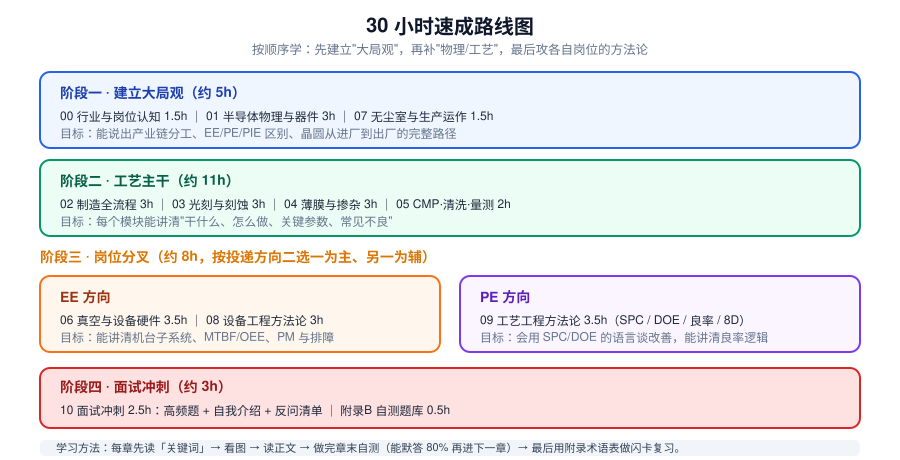

# 半导体 EE / PE 岗速成课（约 30 小时）

面向**零半导体行业背景、正在秋招投 EE（设备工程师）/ PE（制程工程师）**的同学。

> **完全没接触过半导体？先看 [`00-零基础补课.md`](00-零基础补课.md)。**
> 那一章用大白话讲清"芯片是什么、纳米有多小、电压电流是啥"，是从零起步的入口，其他章节都是从它延伸出去的。

目标不是让你变成专家，而是让你在 **2~3 周、约 30 小时**内达到：

- 听得懂面试官在说什么（不再被缩写轰炸：OEE、ESC、FDC、Overlay、Cpk、ARDE…）
- 能讲清一条完整的逻辑链：**做什么 → 怎么做 → 关键参数 → 出问题是哪些原因 → 怎么排查**
- 面试时能给出**结构化的技术回答**，而不是背书
- 知道进厂后前三个月会面对什么，减少预期落差

---

## 一、怎么用这套教材

1. **先看每章开头的「🧑‍🏫 人话速读」和「黑话翻译表」**，再读正文。看不懂正文就回来重读人话部分——这是为没基础的人专门写的。
2. **严格按顺序学**。前 4 章是"骨架"，跳过后面会一直卡。
3. 每章流程：**读人话速读 → 看关键词 → 看插图 → 读正文 → 做章末自测**。自测能默答 80% 再进下一章。
4. 名词记不住随时查 `附录A-术语速查表.md`，这张表建议打印。
5. 面试前 3 天集中刷 `11-面试冲刺.md` 和 `附录B-自测题库.md`。
6. **不要死记硬背参数，更不要推导公式**。面试官考的是"你知不知道这个量受什么影响、往哪个方向变"，不是数值本身。

---

## 二、学时分配与路线图

| # | 章节 | 建议学时 | EE 必学 | PE 必学 | 核心产出 |
|---|------|---------|:---:|:---:|------|
| 00 | [零基础补课：芯片到底是个啥](00-零基础补课.md) | 2.5h | ★★★ | ★★★ | 尺度感、导电本质、开关与晶圆，零基础入口 |
| 01 | [行业与岗位认知](01-行业与岗位认知.md) | 1.5h | ★★★ | ★★★ | 讲清产业链、EE/PE/PIE 分工、轮班与现实 |
| 02 | [半导体物理与器件基础](02-半导体物理与器件基础.md) | 3h | ★★ | ★★★ | 能解释掺杂、PN 结、MOSFET、Vt、短沟道效应 |
| 03 | [晶圆制造全流程](03-晶圆制造全流程.md) | 3h | ★★★ | ★★★ | 从硅料到成品芯片的完整路径脱口而出 |
| 04 | [光刻与刻蚀](04-光刻与刻蚀.md) | 3h | ★★★ | ★★★ | CD/Overlay/选择比/各向异性/RF |
| 05 | [薄膜·掺杂·热处理](05-薄膜掺杂与热处理.md) | 3h | ★★★ | ★★★ | CVD/PVD/ALD 取舍、注入+退火、Rs/Xj |
| 06 | [CMP·清洗·量测](06-CMP清洗与量测.md) | 2h | ★★ | ★★★ | Preston 方程、双大马士革、量测手段选型 |
| 07 | [真空与设备硬件](07-真空与设备硬件.md) | 3.5h | ★★★ | ★★ | 泵组、ESC、RF、MFC、机台子系统 |
| 08 | [无尘室与生产运作](08-无尘室与生产运作.md) | 1.5h | ★★ | ★★ | 洁净度、MES/Lot/Recipe、Throughput |
| 09 | [设备工程方法论 EE](09-设备工程方法论.md) | 3h | ★★★ | ★ | MTBF/MTTR/OEE、PM、FDC、8D、安全 |
| 10 | [工艺工程方法论 PE](10-工艺工程方法论.md) | 3.5h | ★ | ★★★ | SPC/Cpk、DOE、良率、异常处理 |
| 11 | [面试冲刺](11-面试冲刺.md) | 2.5h | ★★★ | ★★★ | 高频题答案框架、自我介绍、反问清单 |
| A | [术语速查表](附录A-术语速查表.md) | 随时 | ★★★ | ★★★ | 中英对照 + 一句话解释 |
| B | [自测题库](附录B-自测题库.md) | 0.5h | ★★★ | ★★★ | 60+ 题，含参考答案 |

**合计 ≈ 32 小时**（其中「零基础补课」2.5h，有电子/物理基础可跳过，则约 29.5 小时）。

### 三条路线，按你的时间选

| 路线 | 章节顺序 | 时长 | 适合 |
|---|---|---|---|
| **完整版** | 00 → 11 全部 | ~32h | 有 2~3 周，想系统学 |
| **标准版** | 01 → 11（跳过补课篇） | ~29.5h | 学过电路/模电，能接受术语 |
| **冲刺版** | 00 → 01 → 02 → 03 → 04 → 07/09（EE）或 10（PE）→ 11 | ~20h | 只有一周，覆盖约 80% 考点 |

> 判断标准很简单：看到"能带""耗尽区"这类词觉得陌生，就老老实实从 00 开始；看得懂就直接 01。

---

## 三、EE 与 PE 到底差在哪（一句话版）

| | EE 设备工程师 | PE 制程工程师 |
|---|---|---|
| **主人** | 机台（硬件） | 工艺（配方 Recipe） |
| **核心问题** | 机台为什么坏了 / 怎么不让它坏 | 做出来的东西为什么不合格 / 怎么调好 |
| **日常** | 报警处理、PM 保养、换 Parts、验机 | 看 SPC、跑 DOE、处理异常、写 8D |
| **关键指标** | MTBF / MTTR / OEE / Uptime | Cpk / Yield / CD 均匀性 / 缺陷数 |
| **更适合的性格** | 动手能力强、喜欢拆机器、抗突发 | 数据敏感、逻辑严谨、耐得住磨参数 |
| **典型对口专业** | 机械、电气、自动化、机电 | 微电子、材料、物理、化学、化工 |

**判断口诀**：换一台同型号机台跑同一个 Recipe——结果跟着走是机台问题（EE），结果一样差是工艺问题（PE）。

---

## 四、必背的 20 个缩写（附录A 有完整版）

`EE / PE / PIE / MFG / YE / TD` · `FEOL / BEOL` · `CVD / PVD / ALD / Epi` · `CMP` · `CD / CDU / Overlay / LER` · `SPC / Cpk / DOE / FMEA / 8D` · `MTBF / MTTR / OEE` · `FDC / APC / R2R` · `MES / Lot / Recipe / FOUP` · `ESC / MFC / RF / PM`

---

## 五、插图清单

全部插图在 `images/` 目录，均为矢量 SVG，可直接用于笔记、PPT 或打印。

| 图 | 内容 |
|---|---|
| `01-industry-chain.svg` | 产业链与三类商业模式 |
| `02-role-map.svg` | Fab 岗位地图与 EE/PE 分工 |
| `03-pn-junction.svg` | 能带、掺杂、PN 结与三条关键曲线 |
| `04-mosfet.svg` | MOSFET 结构与截止/导通、电性参数 |
| `05-device-evolution.svg` | Planar → FinFET → GAA |
| `06-cmos-flow.svg` | 八大模块 + FEOL/BEOL + 核心循环 |
| `07-litho-flow.svg` | 光刻八步与瑞利判据 |
| `08-etch.svg` | 湿法/干法对比、三种机理、六个 KPI |
| `09-plasma-source.svg` | CCP vs ICP、RF 三件套 |
| `10-deposition.svg` | PVD/CVD/ALD/Epi 台阶覆盖对比 |
| `11-implant-anneal.svg` | 注入机、高斯剖面、退火修复 |
| `12-cmp-damascene.svg` | CMP 原理、Preston 方程、双大马士革 |
| `13-vacuum-system.svg` | 真空区间、泵组串联、三种真空计 |
| `14-tool-architecture.svg` | 机台 10 大子系统剖面 |
| `15-oee-mtbf.svg` | MTBF/MTTR/OEE 与提升杠杆 |
| `16-troubleshooting.svg` | 排查九步、5Why、5M1E |
| `17-spc-cpk.svg` | 控制图、判异规则、Cpk |
| `18-doe.svg` | OFAT vs DOE、2² 设计、七步法 |
| `19-yield-defect.svg` | 良率模型、Bin Map、缺陷指纹 |
| `20-cleanroom.svg` | 层流、洁净等级、污染源 |
| `21-metrology.svg` | 六大量测 + 失效分析手段 |
| `22-roadmap.svg` | 32 小时学习路线 |
| `23-scale.svg` | 尺度感：从头发到硅原子的对数尺 |
| `24-conduction.svg` | 导体/半导体/绝缘体 + 水管类比电路 |
| `25-chip-city.svg` | 芯片 = 开关阵列 = 立体城市 |

---

## 六、免责说明

本教材为**面试速成向整理**，内容基于公开资料与行业通识编写。具体工艺参数（温度、压力、气体配比等）因厂商、节点、机台型号差异极大，**切勿把本教材中的数值当作实际工艺规范**。进厂后一切以公司 SOP、Recipe 与机台 Spec 为准。
